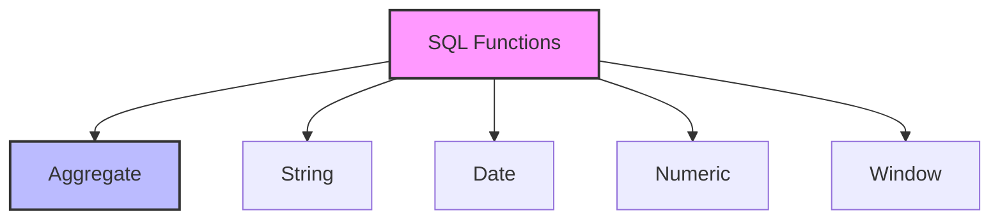

# SQL Functions: Your Data Transformation Toolkit

## Introduction: Why Functions Matter
Imagine you're a chef with a set of specialized tools - each one designed for a specific task. SQL functions are like these tools - they help you transform, analyze, and manipulate your data in powerful ways. Whether you're calculating totals, formatting dates, or extracting patterns, functions are your go-to tools for data processing.

---

## What are SQL Functions?
**SQL functions** are predefined operations that perform specific tasks on data. They help:
- Transform data
- Perform calculations
- Format output
- Handle dates and times
- Process strings
- Aggregate values

---

## Types of SQL Functions (with Examples)

### 1. Aggregate Functions
```sql
-- Basic aggregation
SELECT 
    AVG(salary) as avg_salary,
    MAX(salary) as max_salary,
    MIN(salary) as min_salary,
    COUNT(*) as employee_count,
    SUM(salary) as total_salary
FROM employees;

-- With grouping
SELECT 
    department,
    AVG(salary) as dept_avg_salary,
    COUNT(*) as dept_size
FROM employees
GROUP BY department;
```

### 2. String Functions
```sql
-- Text manipulation
SELECT 
    CONCAT(first_name, ' ', last_name) as full_name,
    UPPER(email) as email_upper,
    LOWER(username) as username_lower,
    LENGTH(description) as desc_length,
    SUBSTRING(phone, 1, 3) as area_code
FROM users;

-- Pattern matching
SELECT *
FROM products
WHERE name LIKE '%phone%'
AND description REGEXP '^[A-Z]';
```

### 3. Date Functions
```sql
-- Date calculations
SELECT 
    order_date,
    DATE_ADD(order_date, INTERVAL 7 DAY) as delivery_date,
    DATEDIFF(CURRENT_DATE, order_date) as days_since_order,
    DATE_FORMAT(order_date, '%Y-%m-%d') as formatted_date
FROM orders;

-- Date filtering
SELECT *
FROM orders
WHERE order_date BETWEEN 
    DATE_SUB(CURRENT_DATE, INTERVAL 30 DAY)
    AND CURRENT_DATE;
```

### 4. Numeric Functions
```sql
-- Mathematical operations
SELECT 
    price,
    ROUND(price, 2) as rounded_price,
    CEIL(price) as ceiling_price,
    FLOOR(price) as floor_price,
    ABS(price - 100) as price_diff
FROM products;

-- Random values
SELECT 
    RAND() as random_number,
    FLOOR(RAND() * 100) as random_int
FROM dual;
```

### 5. Window Functions
```sql
-- Ranking
SELECT 
    employee_id,
    salary,
    RANK() OVER (ORDER BY salary DESC) as salary_rank,
    DENSE_RANK() OVER (ORDER BY salary DESC) as dense_rank,
    ROW_NUMBER() OVER (ORDER BY salary DESC) as row_num
FROM employees;

-- Running totals
SELECT 
    order_date,
    amount,
    SUM(amount) OVER (
        ORDER BY order_date
        ROWS BETWEEN UNBOUNDED PRECEDING AND CURRENT ROW
    ) as running_total
FROM orders;
```

---

## Visualizing Function Categories


---

## Real-World Examples

### Example 1: Sales Analysis
```sql
/* Monthly sales analysis with year-over-year comparison */
SELECT 
    DATE_FORMAT(order_date, '%Y-%m') as month,
    SUM(amount) as total_sales,
    AVG(amount) as avg_order_value,
    COUNT(*) as order_count,
    SUM(amount) OVER (
        ORDER BY DATE_FORMAT(order_date, '%Y-%m')
        ROWS BETWEEN 11 PRECEDING AND CURRENT ROW
    ) as rolling_12m_sales
FROM orders
GROUP BY DATE_FORMAT(order_date, '%Y-%m')
ORDER BY month;
```

### Example 2: Customer Segmentation
```sql
/* Customer value analysis with segmentation */
SELECT 
    customer_id,
    CONCAT(first_name, ' ', last_name) as customer_name,
    COUNT(DISTINCT order_id) as total_orders,
    SUM(amount) as total_spent,
    AVG(amount) as avg_order_value,
    MAX(order_date) as last_order_date,
    CASE 
        WHEN SUM(amount) > 1000 THEN 'High Value'
        WHEN SUM(amount) > 500 THEN 'Medium Value'
        ELSE 'Low Value'
    END as customer_segment
FROM customers c
JOIN orders o ON c.customer_id = o.customer_id
GROUP BY customer_id, first_name, last_name
ORDER BY total_spent DESC;
```

---

## Best Practices & Key Takeaways
- Choose appropriate functions for your needs
- Consider performance implications
- Handle NULL values properly
- Use meaningful aliases
- Test with edge cases
- Document complex calculations

---

## Common Pitfalls to Avoid
- Using aggregate functions without GROUP BY
- Ignoring NULL handling
- Overusing complex functions
- Not considering performance
- Mixing data types incorrectly
- Forgetting function limitations

---

## Further Exploration
- "SQL for Data Analysis" by Cathy Tanimura
- "Advanced SQL Programming" by Joe Celko
- Practice on Mode Analytics or SQLZoo

---
*This guide is designed to make SQL functions clear and practical for everyone. For hands-on practice, refer to the exercises and projects in the course materials.* 