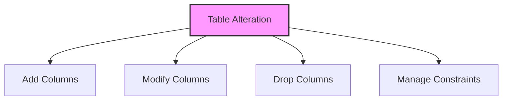

# SQL ALTER TABLE

## 🎯 Learning Outcomes
By the end of this overview, you will understand:
- How to modify existing tables
- Adding and removing columns
- Modifying column properties
- Managing constraints
- Best practices for table alterations

## 📚 Introduction
ALTER TABLE:
- Modifies existing table structure
- Adds or removes columns
- Changes column properties
- Manages table constraints
- Updates table definitions

## 🔄 Table Alteration Process


## 📊 Adding Columns
Add new columns to an existing table.

### Syntax
```sql
ALTER TABLE table_name
ADD column_name datatype;
```

### Example
```sql
ALTER TABLE Customers
ADD Email VARCHAR(100);
```

## 📈 Modifying Columns
Change column properties in an existing table.

### Syntax
```sql
ALTER TABLE table_name
MODIFY column_name new_datatype;
```

### Example
```sql
ALTER TABLE Customers
MODIFY Name VARCHAR(100);
```

## 🔧 Dropping Columns
Remove columns from an existing table.

### Syntax
```sql
ALTER TABLE table_name
DROP COLUMN column_name;
```

### Example
```sql
ALTER TABLE Customers
DROP COLUMN Email;
```

## 🎯 Managing Constraints
Add or remove constraints from tables.

### Adding Primary Key
```sql
ALTER TABLE Customers
ADD PRIMARY KEY (ID);
```

### Adding Foreign Key
```sql
ALTER TABLE Orders
ADD FOREIGN KEY (CustomerID) REFERENCES Customers(ID);
```

### Adding Unique Constraint
```sql
ALTER TABLE Users
ADD UNIQUE (Email);
```

### Removing Constraints
```sql
ALTER TABLE Customers
DROP PRIMARY KEY;
```

## 🎓 Best Practices
1. Backup before alterations
2. Test changes in development
3. Consider data impact
4. Plan for dependencies
5. Document changes
6. Verify constraints
7. Check performance

## ⚠️ Common Errors
- Invalid syntax
- Data type conflicts
- Constraint violations
- Permission issues
- Dependency problems
- Data loss risks
- Performance impact

## 📝 Quick Summary
- ALTER TABLE syntax
- Column management
- Constraint handling
- Data type changes
- Table modifications
- Impact assessment
- Error handling

## 🔍 Important Considerations
1. Data preservation
2. Constraint management
3. Performance impact
4. Dependency handling
5. Backup requirements
6. Testing procedures
7. Rollback plan

## 💡 Tips
- Always backup first
- Test changes thoroughly
- Consider dependencies
- Document modifications
- Monitor performance
- Plan rollback
- Regular maintenance

---
*This overview provides a comprehensive understanding of SQL ALTER TABLE. For practical implementation and examples, refer to the hands-on sections of the course.* 