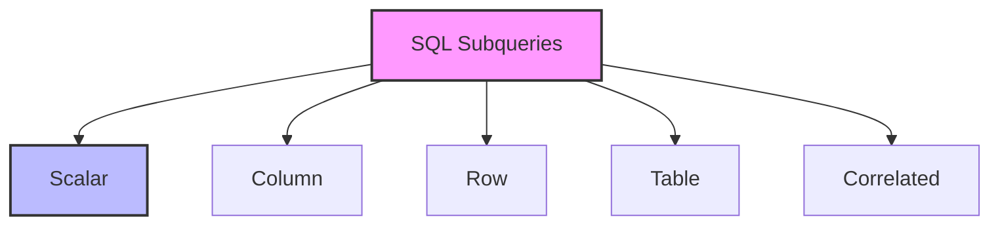

# SQL Subqueries: Nested Queries for Complex Data Analysis

## Introduction: Why Subqueries Matter
Imagine solving a complex puzzle by breaking it into smaller, manageable pieces. SQL subqueries work the same way - they help you solve complex data problems by breaking them down into smaller, more manageable queries. Whether you're comparing values, filtering data, or performing calculations, subqueries are your secret weapon for advanced data analysis.

---

## What are SQL Subqueries?
**SQL subqueries** are queries nested within other queries. They help:
- Compare values
- Filter data
- Calculate values
- Create derived tables
- Perform complex operations
- Break down complex problems

---

## Types of SQL Subqueries (with Examples)

### 1. Scalar Subqueries
```sql
-- Single value comparison
SELECT employee_name, salary
FROM employees
WHERE salary > (
    SELECT AVG(salary)
    FROM employees
);

-- In calculations
SELECT 
    product_name,
    price,
    price - (
        SELECT AVG(price)
        FROM products
    ) as price_diff
FROM products;
```

### 2. Column Subqueries
```sql
-- Multiple value comparison
SELECT department_name
FROM departments
WHERE department_id IN (
    SELECT department_id
    FROM employees
    WHERE salary > 50000
);

-- With ANY/SOME
SELECT product_name
FROM products
WHERE price > ANY (
    SELECT price
    FROM products
    WHERE category = 'Electronics'
);
```

### 3. Row Subqueries
```sql
-- Row comparison
SELECT *
FROM employees
WHERE (department, salary) IN (
    SELECT department, MAX(salary)
    FROM employees
    GROUP BY department
);

-- With EXISTS
SELECT customer_name
FROM customers c
WHERE EXISTS (
    SELECT 1
    FROM orders o
    WHERE o.customer_id = c.customer_id
    AND o.amount > 1000
);
```

### 4. Table Subqueries
```sql
-- In FROM clause
SELECT dept_name, avg_salary
FROM (
    SELECT 
        department as dept_name,
        AVG(salary) as avg_salary
    FROM employees
    GROUP BY department
) as dept_stats
WHERE avg_salary > 50000;

-- With JOIN
SELECT e.employee_name, d.dept_name
FROM employees e
JOIN (
    SELECT department_id, department_name as dept_name
    FROM departments
    WHERE location = 'New York'
) d ON e.department_id = d.department_id;
```

### 5. Correlated Subqueries
```sql
-- With correlation
SELECT 
    employee_name,
    salary,
    (
        SELECT AVG(salary)
        FROM employees e2
        WHERE e2.department = e1.department
    ) as dept_avg_salary
FROM employees e1;

-- In WHERE clause
SELECT product_name
FROM products p
WHERE price > (
    SELECT AVG(price)
    FROM products
    WHERE category = p.category
);
```

---

## Visualizing Subquery Types


---

## Real-World Examples

### Example 1: Sales Analysis
```sql
/* Products with above-average sales in their category */
SELECT 
    p.product_name,
    p.category,
    p.price,
    (
        SELECT AVG(price)
        FROM products
        WHERE category = p.category
    ) as category_avg_price,
    (
        SELECT COUNT(*)
        FROM order_items oi
        WHERE oi.product_id = p.product_id
    ) as total_orders
FROM products p
WHERE p.price > (
    SELECT AVG(price)
    FROM products
    WHERE category = p.category
)
ORDER BY category, price DESC;
```

### Example 2: Employee Performance
```sql
/* Employees with above-average performance in their department */
SELECT 
    e.employee_name,
    e.department,
    e.salary,
    e.hire_date,
    (
        SELECT AVG(salary)
        FROM employees
        WHERE department = e.department
    ) as dept_avg_salary,
    (
        SELECT COUNT(*)
        FROM projects p
        WHERE p.lead_employee_id = e.employee_id
    ) as projects_led
FROM employees e
WHERE e.salary > (
    SELECT AVG(salary)
    FROM employees
    WHERE department = e.department
)
AND EXISTS (
    SELECT 1
    FROM projects p
    WHERE p.lead_employee_id = e.employee_id
    AND p.status = 'Completed'
)
ORDER BY department, salary DESC;
```

---

## Best Practices & Key Takeaways
- Use appropriate subquery types
- Consider performance implications
- Keep subqueries simple
- Use meaningful aliases
- Test with different data scenarios
- Document complex logic

---

## Common Pitfalls to Avoid
- Overusing subqueries
- Ignoring performance impact
- Writing overly complex subqueries
- Not handling NULL values
- Forgetting correlation
- Mixing subquery types incorrectly

---

## Further Exploration
- "SQL for Smarties" by Joe Celko
- "SQL Performance Explained" by Markus Winand
- Practice on LeetCode or HackerRank

---
*This guide is designed to make SQL subqueries clear and practical for everyone. For hands-on practice, refer to the exercises and projects in the course materials.* 