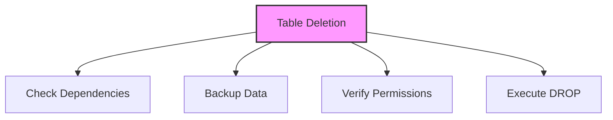

# SQL DROP TABLE

## 🎯 Learning Outcomes
By the end of this overview, you will understand:
- How to drop tables in SQL
- DROP TABLE syntax
- Table deletion process
- Impact on related objects
- Best practices for table deletion

## 📚 Introduction
DROP TABLE:
- Permanently removes tables
- Deletes all table data
- Removes table structure
- Affects related objects
- Requires careful consideration

## 🔄 Table Deletion Process


## 📊 DROP TABLE Statement
The DROP TABLE statement permanently removes a table and all its data.

### Basic Syntax
```sql
DROP TABLE table_name;
```

### Example
```sql
DROP TABLE Customers;
```

## 📈 DROP TABLE IF EXISTS
Prevents errors when dropping non-existent tables.

### Syntax
```sql
DROP TABLE IF EXISTS table_name;
```

### Example
```sql
DROP TABLE IF EXISTS Customers;
```

## 🔧 Multiple Table Deletion
Drop multiple tables in a single statement.

### Syntax
```sql
DROP TABLE table1, table2, table3;
```

### Example
```sql
DROP TABLE Customers, Orders, Products;
```

## 🎯 Impact on Related Objects
Consider effects on:
- Foreign key constraints
- Views
- Triggers
- Stored procedures
- Indexes
- Permissions
- Dependencies

## 🎓 Best Practices
1. Backup before dropping
2. Check dependencies
3. Verify permissions
4. Use IF EXISTS clause
5. Document deletion
6. Consider impact
7. Plan recovery

## ⚠️ Common Errors
- Permission denied
- Table in use
- Foreign key constraints
- Non-existent table
- Syntax errors
- Dependency issues
- Data loss

## 📝 Quick Summary
- DROP TABLE syntax
- IF EXISTS clause
- Multiple table deletion
- Permission requirements
- Dependency handling
- Data backup
- Error prevention

## 🔍 Important Considerations
1. Data backup
2. Dependencies
3. User permissions
4. System impact
5. Recovery plan
6. Testing procedures
7. Documentation

## 💡 Tips
- Always backup first
- Check dependencies
- Verify permissions
- Use IF EXISTS
- Document process
- Test in development
- Plan recovery

---
*This overview provides a comprehensive understanding of SQL DROP TABLE. For practical implementation and examples, refer to the hands-on sections of the course.* 