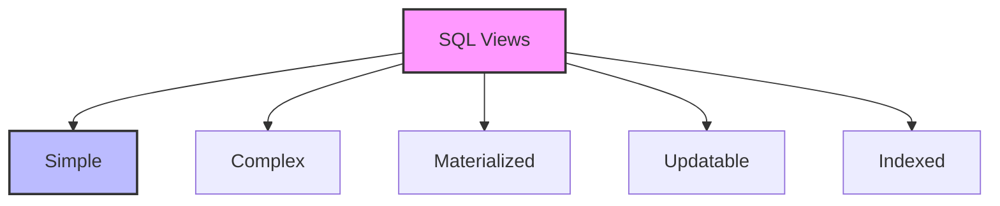

# SQL Views: Your Data's Window to the World

## Introduction: Why Views Matter
Imagine having a set of specialized windows in your house - each one giving you a different perspective of the outside world. SQL views are like these windows - they provide different ways to look at your data, making it easier to access, understand, and work with complex information. Whether you're simplifying complex queries, securing sensitive data, or creating reusable data perspectives, views are your key to better data management.

---

## What are SQL Views?
**SQL views** are virtual tables based on the result set of a SQL statement. They help:
- Simplify complex queries
- Secure sensitive data
- Provide data abstraction
- Create reusable queries
- Maintain data consistency
- Improve query performance

---

## Types of SQL Views (with Examples)

### 1. Simple Views
```sql
-- Basic view
CREATE VIEW employee_details AS
SELECT 
    employee_id,
    first_name,
    last_name,
    department,
    salary
FROM employees;

-- Using the view
SELECT * FROM employee_details
WHERE department = 'IT';
```

### 2. Complex Views
```sql
-- View with joins and calculations
CREATE VIEW sales_summary AS
SELECT 
    p.product_name,
    c.category_name,
    COUNT(o.order_id) as total_orders,
    SUM(oi.quantity) as total_quantity,
    SUM(oi.quantity * oi.price) as total_revenue
FROM products p
JOIN categories c ON p.category_id = c.category_id
JOIN order_items oi ON p.product_id = oi.product_id
JOIN orders o ON oi.order_id = o.order_id
GROUP BY p.product_name, c.category_name;

-- Using the complex view
SELECT * FROM sales_summary
WHERE total_revenue > 10000
ORDER BY total_revenue DESC;
```

### 3. Materialized Views
```sql
-- Creating a materialized view
CREATE MATERIALIZED VIEW monthly_sales AS
SELECT 
    DATE_TRUNC('month', order_date) as month,
    SUM(amount) as total_sales,
    COUNT(*) as order_count
FROM orders
GROUP BY DATE_TRUNC('month', order_date);

-- Refreshing the view
REFRESH MATERIALIZED VIEW monthly_sales;
```

### 4. Updatable Views
```sql
-- Creating an updatable view
CREATE VIEW active_employees AS
SELECT 
    employee_id,
    first_name,
    last_name,
    email,
    department
FROM employees
WHERE status = 'active'
WITH CHECK OPTION;

-- Updating through the view
UPDATE active_employees
SET department = 'IT'
WHERE employee_id = 1001;
```

### 5. Indexed Views
```sql
-- Creating an indexed view
CREATE VIEW product_sales WITH SCHEMABINDING AS
SELECT 
    product_id,
    COUNT_BIG(*) as total_orders,
    SUM(quantity) as total_quantity
FROM dbo.order_items
GROUP BY product_id;

-- Creating an index on the view
CREATE UNIQUE CLUSTERED INDEX idx_product_sales
ON product_sales(product_id);
```

---

## Visualizing View Types


---

## Real-World Examples

### Example 1: Sales Dashboard
```sql
/* View for sales dashboard */
CREATE VIEW sales_dashboard AS
SELECT 
    DATE_FORMAT(o.order_date, '%Y-%m') as month,
    c.category_name,
    p.product_name,
    COUNT(DISTINCT o.order_id) as order_count,
    SUM(oi.quantity) as total_quantity,
    SUM(oi.quantity * oi.price) as total_revenue,
    AVG(oi.price) as avg_price
FROM orders o
JOIN order_items oi ON o.order_id = oi.order_id
JOIN products p ON oi.product_id = p.product_id
JOIN categories c ON p.category_id = c.category_id
GROUP BY 
    DATE_FORMAT(o.order_date, '%Y-%m'),
    c.category_name,
    p.product_name;

-- Using the dashboard view
SELECT * FROM sales_dashboard
WHERE month = '2024-03'
ORDER BY total_revenue DESC;
```

### Example 2: Employee Management
```sql
/* View for employee management */
CREATE VIEW employee_management AS
SELECT 
    e.employee_id,
    CONCAT(e.first_name, ' ', e.last_name) as full_name,
    d.department_name,
    m.manager_name,
    e.salary,
    e.hire_date,
    COUNT(p.project_id) as project_count,
    AVG(p.completion_rate) as avg_completion_rate
FROM employees e
JOIN departments d ON e.department_id = d.department_id
LEFT JOIN (
    SELECT 
        employee_id,
        CONCAT(first_name, ' ', last_name) as manager_name
    FROM employees
) m ON e.manager_id = m.employee_id
LEFT JOIN projects p ON e.employee_id = p.lead_employee_id
GROUP BY 
    e.employee_id,
    e.first_name,
    e.last_name,
    d.department_name,
    m.manager_name,
    e.salary,
    e.hire_date;

-- Using the management view
SELECT * FROM employee_management
WHERE department_name = 'IT'
AND avg_completion_rate > 0.8
ORDER BY salary DESC;
```

---

## Best Practices & Key Takeaways
- Use views for complex queries
- Consider performance implications
- Keep views focused and simple
- Use meaningful names
- Document view purposes
- Test view performance

---

## Common Pitfalls to Avoid
- Creating too many views
- Overcomplicating views
- Ignoring view maintenance
- Not considering updates
- Forgetting indexes
- Mixing view types incorrectly

---

## Further Exploration
- "SQL Server Concurrency" by Kalen Delaney
- "Database Design for Mere Mortals" by Michael J. Hernandez
- Practice on Mode Analytics or SQLZoo

---
*This guide is designed to make SQL views clear and practical for everyone. For hands-on practice, refer to the exercises and projects in the course materials.* 