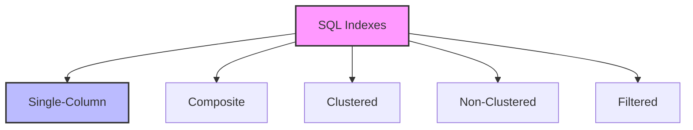

# SQL Indexes: The Speed Boosters of Database Queries

## Introduction: Why Indexes Matter
Imagine trying to find a specific book in a library without any organization system - it would take forever! SQL indexes are like a library's catalog system - they help you find data quickly without having to scan through every row. Whether you're searching for specific records, joining tables, or sorting results, indexes are your key to better query performance.

---

## What are SQL Indexes?
**SQL indexes** are data structures that improve the speed of data retrieval operations. They help:
- Speed up searches
- Optimize joins
- Improve sorting
- Enforce uniqueness
- Reduce I/O operations
- Enhance query performance

---

## Types of SQL Indexes (with Examples)

### 1. Single-Column Indexes
```sql
-- Basic index
CREATE INDEX idx_employee_name
ON employees(last_name);

-- Unique index
CREATE UNIQUE INDEX idx_employee_email
ON employees(email);

-- Using the index
SELECT * FROM employees
WHERE last_name = 'Smith';
```

### 2. Composite Indexes
```sql
-- Multiple columns
CREATE INDEX idx_employee_dept_salary
ON employees(department, salary);

-- Using the composite index
SELECT * FROM employees
WHERE department = 'IT'
AND salary > 50000;
```

### 3. Clustered Indexes
```sql
-- Primary key as clustered index
CREATE TABLE products (
    product_id INT PRIMARY KEY,
    name VARCHAR(100),
    price DECIMAL(10,2)
);

-- Custom clustered index
CREATE CLUSTERED INDEX idx_order_date
ON orders(order_date);
```

### 4. Non-Clustered Indexes
```sql
-- Basic non-clustered index
CREATE NONCLUSTERED INDEX idx_customer_name
ON customers(last_name, first_name);

-- Including additional columns
CREATE NONCLUSTERED INDEX idx_order_customer
ON orders(customer_id)
INCLUDE (order_date, total_amount);
```

### 5. Filtered Indexes
```sql
-- Index on specific condition
CREATE INDEX idx_active_employees
ON employees(salary)
WHERE status = 'active';

-- Using the filtered index
SELECT * FROM employees
WHERE status = 'active'
AND salary > 50000;
```

---

## Visualizing Index Types


---

## Real-World Examples

### Example 1: E-commerce Database
```sql
/* Indexes for e-commerce system */
-- Product search optimization
CREATE INDEX idx_product_search
ON products(category, price, stock_quantity);

-- Order tracking optimization
CREATE INDEX idx_order_tracking
ON orders(customer_id, order_date, status)
INCLUDE (total_amount, shipping_address);

-- Customer search optimization
CREATE INDEX idx_customer_search
ON customers(last_name, first_name, email)
WHERE is_active = 1;

-- Using the indexes
SELECT p.product_name, p.price
FROM products p
WHERE p.category = 'Electronics'
AND p.price BETWEEN 100 AND 500
AND p.stock_quantity > 0;

SELECT o.order_id, o.order_date, o.total_amount
FROM orders o
WHERE o.customer_id = 1001
AND o.order_date >= DATE_SUB(CURRENT_DATE, INTERVAL 30 DAY)
ORDER BY o.order_date DESC;
```

### Example 2: Employee Management System
```sql
/* Indexes for employee management */
-- Employee search optimization
CREATE INDEX idx_employee_search
ON employees(department, job_title, hire_date)
INCLUDE (salary, manager_id);

-- Performance review optimization
CREATE INDEX idx_performance_review
ON performance_reviews(employee_id, review_date)
INCLUDE (rating, comments);

-- Project tracking optimization
CREATE INDEX idx_project_tracking
ON projects(lead_employee_id, status, start_date)
INCLUDE (project_name, budget);

-- Using the indexes
SELECT e.employee_id, e.first_name, e.last_name, e.salary
FROM employees e
WHERE e.department = 'IT'
AND e.job_title = 'Developer'
AND e.hire_date >= '2020-01-01'
ORDER BY e.salary DESC;

SELECT p.project_name, p.status, p.budget
FROM projects p
WHERE p.lead_employee_id = 1001
AND p.status = 'In Progress'
ORDER BY p.start_date DESC;
```

---

## Best Practices & Key Takeaways
- Create indexes on frequently queried columns
- Consider index maintenance overhead
- Monitor index usage and performance
- Use appropriate index types
- Keep indexes up to date
- Test index impact on queries

---

## Common Pitfalls to Avoid
- Creating too many indexes
- Indexing every column
- Ignoring index maintenance
- Not considering updates
- Forgetting to monitor usage
- Using wrong index types

---

## Further Exploration
- "SQL Server Performance Tuning" by Grant Fritchey
- "Database Performance and Scalability" by O'Reilly
- Practice on Mode Analytics or SQLZoo

---
*This guide is designed to make SQL indexes clear and practical for everyone. For hands-on practice, refer to the exercises and projects in the course materials.* 