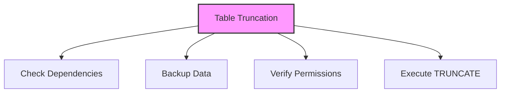
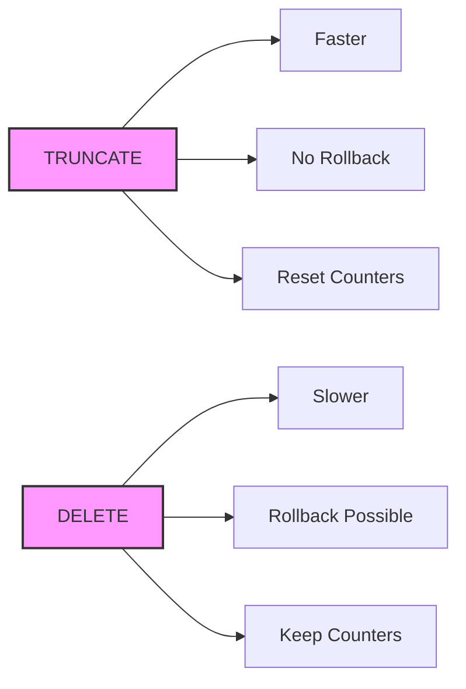

# SQL TRUNCATE TABLE

## 🎯 Learning Outcomes
By the end of this overview, you will understand:
- How to truncate tables in SQL
- TRUNCATE TABLE syntax
- Differences from DELETE
- Impact on related objects
- Best practices for truncation

## 📚 Introduction
TRUNCATE TABLE:
- Removes all rows from a table
- Resets auto-increment counters
- Faster than DELETE
- Cannot be rolled back
- Requires careful consideration

## 🔄 Table Truncation Process


## 📊 TRUNCATE TABLE Statement
The TRUNCATE TABLE statement removes all rows from a table.

### Basic Syntax
```sql
TRUNCATE TABLE table_name;
```

### Example
```sql
TRUNCATE TABLE Customers;
```

## 📈 TRUNCATE vs DELETE
Key differences between TRUNCATE and DELETE:

### TRUNCATE
- Removes all rows
- Faster execution
- Cannot be rolled back
- Resets auto-increment
- Minimal logging

### DELETE
- Can remove specific rows
- Slower execution
- Can be rolled back
- Maintains auto-increment
- Full logging

## 🔧 Impact on Related Objects
Consider effects on:
- Foreign key constraints
- Triggers
- Indexes
- Auto-increment values
- Table statistics
- Permissions
- Dependencies

## 🎯 Best Practices
1. Backup before truncation
2. Check dependencies
3. Verify permissions
4. Consider alternatives
5. Document operation
6. Plan for recovery
7. Test in development

## ⚠️ Common Errors
- Permission denied
- Table in use
- Foreign key constraints
- Non-existent table
- Syntax errors
- Dependency issues
- Data loss

## 📝 Quick Summary
- TRUNCATE TABLE syntax
- Performance benefits
- Irreversible operation
- Auto-increment reset
- Permission requirements
- Dependency handling
- Error prevention

## 🔍 Important Considerations
1. Data backup
2. Dependencies
3. User permissions
4. System impact
5. Recovery plan
6. Testing procedures
7. Documentation

## 💡 Tips
- Always backup first
- Check dependencies
- Verify permissions
- Consider alternatives
- Document process
- Test in development
- Plan recovery

## 🔄 Comparison with DELETE


---
*This overview provides a comprehensive understanding of SQL TRUNCATE TABLE. For practical implementation and examples, refer to the hands-on sections of the course.* 