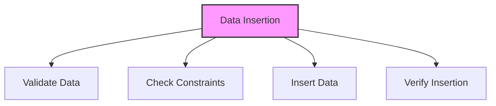

# SQL INSERT Statement

## 🎯 Learning Outcomes
By the end of this overview, you will understand:
- How to insert data in SQL
- INSERT statement syntax
- Different insertion methods
- Data validation
- Best practices for data insertion

## 📚 Introduction
INSERT Statement:
- Adds new rows to tables
- Supports single/multiple rows
- Handles data validation
- Maintains data integrity
- Essential for data management

## 🔄 Insertion Process


## 📊 Basic INSERT Syntax
Insert a single row into a table.

### Syntax
```sql
INSERT INTO table_name (column1, column2, ...)
VALUES (value1, value2, ...);
```

### Example
```sql
INSERT INTO Customers (ID, Name, Age, Address)
VALUES (1, 'John Doe', 30, 'New York');
```

## 📈 Multiple Row Insertion
Insert multiple rows in a single statement.

### Syntax
```sql
INSERT INTO table_name (column1, column2, ...)
VALUES 
    (value1, value2, ...),
    (value1, value2, ...),
    (value1, value2, ...);
```

### Example
```sql
INSERT INTO Customers (ID, Name, Age, Address)
VALUES 
    (1, 'John Doe', 30, 'New York'),
    (2, 'Jane Smith', 25, 'Los Angeles'),
    (3, 'Bob Johnson', 35, 'Chicago');
```

## 🔧 INSERT with SELECT
Insert data from another table.

### Syntax
```sql
INSERT INTO table_name (column1, column2, ...)
SELECT column1, column2, ...
FROM another_table
WHERE condition;
```

### Example
```sql
INSERT INTO NewCustomers (ID, Name, Age)
SELECT ID, Name, Age
FROM OldCustomers
WHERE Status = 'Active';
```

## 🎯 Data Validation
Important considerations:
- Data type matching
- Constraint checking
- NULL handling
- Default values
- Unique constraints
- Foreign key rules
- Check constraints

## 🎓 Best Practices
1. Validate data before insertion
2. Use appropriate data types
3. Handle NULL values
4. Consider constraints
5. Use transactions
6. Document operations
7. Test thoroughly

## ⚠️ Common Errors
- Data type mismatch
- Constraint violation
- NULL in NOT NULL
- Duplicate key
- Foreign key error
- Syntax error
- Permission denied

## 📝 Quick Summary
- INSERT syntax
- Multiple row insertion
- SELECT insertion
- Data validation
- Constraint handling
- Error prevention
- Performance tips

## 🔍 Important Considerations
1. Data validation
2. Constraint checking
3. Performance impact
4. Transaction handling
5. Error management
6. Testing procedures
7. Documentation

## 💡 Tips
- Validate data first
- Use appropriate types
- Handle constraints
- Consider performance
- Use transactions
- Test thoroughly
- Document process

---
*This overview provides a comprehensive understanding of SQL INSERT Statement. For practical implementation and examples, refer to the hands-on sections of the course.* 