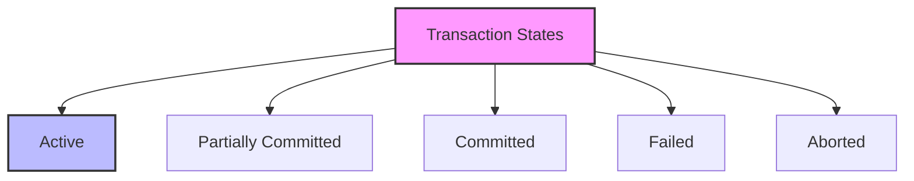

# SQL Transactions: Ensuring Data Integrity and Consistency

## Introduction: Why Transactions Matter
Imagine transferring money between bank accounts - you want both the withdrawal and deposit to happen together, or not at all. SQL transactions work the same way - they ensure that a series of database operations either complete entirely or not at all. Whether you're updating multiple tables, handling complex business logic, or maintaining data consistency, transactions are your safety net for reliable database operations.

---

## What are SQL Transactions?
**SQL transactions** are sequences of database operations that are treated as a single unit. They help:
- Maintain data consistency
- Ensure data integrity
- Handle errors gracefully
- Support concurrent operations
- Provide data isolation
- Enable rollback operations

---

## ACID Properties of Transactions

### 1. Atomicity
```sql
-- Example of atomic transaction
BEGIN TRANSACTION;
    UPDATE accounts SET balance = balance - 100 WHERE account_id = 1;
    UPDATE accounts SET balance = balance + 100 WHERE account_id = 2;
    -- If any statement fails, both updates are rolled back
COMMIT;
```

### 2. Consistency
```sql
-- Maintaining data consistency
BEGIN TRANSACTION;
    -- Check if sufficient funds exist
    IF (SELECT balance FROM accounts WHERE account_id = 1) >= 100
    THEN
        UPDATE accounts SET balance = balance - 100 WHERE account_id = 1;
        UPDATE accounts SET balance = balance + 100 WHERE account_id = 2;
        COMMIT;
    ELSE
        ROLLBACK;
    END IF;
```

### 3. Isolation
```sql
-- Setting isolation level
SET TRANSACTION ISOLATION LEVEL READ COMMITTED;

BEGIN TRANSACTION;
    -- Read data
    SELECT balance FROM accounts WHERE account_id = 1;
    -- Other transactions can't modify this data until commit
    UPDATE accounts SET balance = balance - 100 WHERE account_id = 1;
COMMIT;
```

### 4. Durability
```sql
-- Ensuring transaction durability
BEGIN TRANSACTION;
    -- Changes are written to disk
    UPDATE accounts SET balance = balance - 100 WHERE account_id = 1;
    -- Even if system crashes, changes are preserved
COMMIT;
```

---

## Transaction Control Statements

### 1. BEGIN TRANSACTION
```sql
-- Starting a transaction
BEGIN TRANSACTION;
-- or
START TRANSACTION;
```

### 2. COMMIT
```sql
-- Committing changes
BEGIN TRANSACTION;
    UPDATE accounts SET balance = balance - 100 WHERE account_id = 1;
    UPDATE accounts SET balance = balance + 100 WHERE account_id = 2;
COMMIT;
```

### 3. ROLLBACK
```sql
-- Rolling back changes
BEGIN TRANSACTION;
    UPDATE accounts SET balance = balance - 100 WHERE account_id = 1;
    -- If error occurs
    ROLLBACK;
```

### 4. SAVEPOINT
```sql
-- Using savepoints
BEGIN TRANSACTION;
    UPDATE accounts SET balance = balance - 100 WHERE account_id = 1;
    SAVEPOINT after_withdrawal;
    
    UPDATE accounts SET balance = balance + 100 WHERE account_id = 2;
    -- If second update fails
    ROLLBACK TO SAVEPOINT after_withdrawal;
```

---

## Visualizing Transaction States


---

## Real-World Examples

### Example 1: Banking System
```sql
/* Money transfer transaction */
BEGIN TRANSACTION;
    -- Check sufficient funds
    IF (SELECT balance FROM accounts WHERE account_id = 1) >= 100
    THEN
        -- Withdraw from source account
        UPDATE accounts 
        SET balance = balance - 100 
        WHERE account_id = 1;
        
        -- Deposit to target account
        UPDATE accounts 
        SET balance = balance + 100 
        WHERE account_id = 2;
        
        -- Record transaction
        INSERT INTO transactions (
            from_account, 
            to_account, 
            amount, 
            transaction_date
        ) VALUES (1, 2, 100, CURRENT_TIMESTAMP);
        
        COMMIT;
    ELSE
        ROLLBACK;
    END IF;
```

### Example 2: Inventory Management
```sql
/* Order processing transaction */
BEGIN TRANSACTION;
    -- Check product availability
    IF (SELECT stock_quantity FROM products WHERE product_id = 1) >= 5
    THEN
        -- Create order
        INSERT INTO orders (
            customer_id, 
            order_date, 
            total_amount
        ) VALUES (1001, CURRENT_TIMESTAMP, 500);
        
        -- Get the new order ID
        SET @new_order_id = LAST_INSERT_ID();
        
        -- Add order items
        INSERT INTO order_items (
            order_id, 
            product_id, 
            quantity, 
            price
        ) VALUES (@new_order_id, 1, 5, 100);
        
        -- Update inventory
        UPDATE products 
        SET stock_quantity = stock_quantity - 5 
        WHERE product_id = 1;
        
        COMMIT;
    ELSE
        ROLLBACK;
    END IF;
```

---

## Best Practices & Key Takeaways
- Keep transactions short
- Handle errors properly
- Use appropriate isolation levels
- Test transaction scenarios
- Monitor transaction performance
- Document transaction logic

---

## Common Pitfalls to Avoid
- Long-running transactions
- Nested transactions
- Ignoring error handling
- Not using savepoints
- Overusing transactions
- Forgetting to commit

---

## Further Exploration
- "Database Transactions" by Jim Gray
- "SQL Server Concurrency" by Kalen Delaney
- Practice on Mode Analytics or SQLZoo

---
*This guide is designed to make SQL transactions clear and practical for everyone. For hands-on practice, refer to the exercises and projects in the course materials.* 