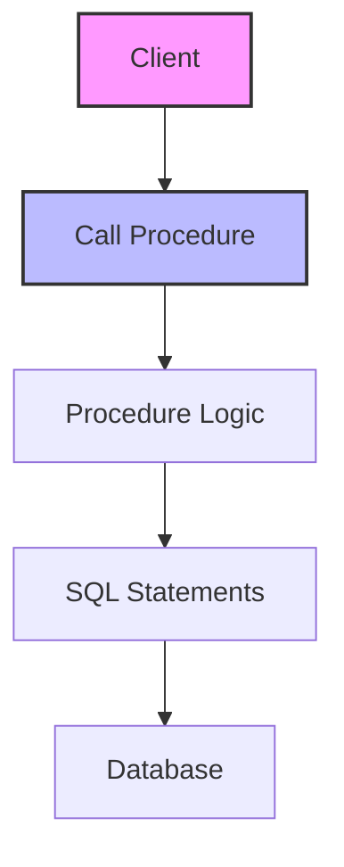

# SQL Stored Procedures: Automating and Securing Database Logic

## Introduction: Why Stored Procedures Matter
Imagine having a set of trusted recipes in your kitchen—each one automates a complex cooking process so you get consistent results every time. SQL stored procedures are like these recipes: they automate, secure, and standardize complex database operations, making your data management more efficient and reliable.

---

## What are SQL Stored Procedures?
**SQL stored procedures** are precompiled collections of SQL statements and optional control-flow logic, stored in the database and executed as a single unit. They help:
- Automate repetitive tasks
- Enforce business rules
- Improve performance
- Enhance security
- Simplify application code
- Support modular programming

---

## Anatomy of a Stored Procedure (with Examples)

### 1. Basic Stored Procedure
```sql
-- Creating a simple procedure
CREATE PROCEDURE GetAllEmployees()
BEGIN
    SELECT * FROM employees;
END;

-- Calling the procedure
CALL GetAllEmployees();
```

### 2. Stored Procedure with Parameters
```sql
-- Procedure with input parameter
CREATE PROCEDURE GetEmployeeById(IN emp_id INT)
BEGIN
    SELECT * FROM employees WHERE employee_id = emp_id;
END;

-- Calling the procedure
CALL GetEmployeeById(1001);
```

### 3. Stored Procedure with Output Parameter
```sql
-- Procedure with output parameter
CREATE PROCEDURE GetEmployeeCount(OUT emp_count INT)
BEGIN
    SELECT COUNT(*) INTO emp_count FROM employees;
END;

-- Calling the procedure
CALL GetEmployeeCount(@total);
SELECT @total;
```

### 4. Stored Procedure with Logic and Transactions
```sql
-- Procedure with business logic and transaction
CREATE PROCEDURE TransferFunds(
    IN from_account INT,
    IN to_account INT,
    IN amount DECIMAL(10,2)
)
BEGIN
    DECLARE sufficient_funds INT;
    START TRANSACTION;
    SELECT balance >= amount INTO sufficient_funds FROM accounts WHERE account_id = from_account;
    IF sufficient_funds THEN
        UPDATE accounts SET balance = balance - amount WHERE account_id = from_account;
        UPDATE accounts SET balance = balance + amount WHERE account_id = to_account;
        INSERT INTO transactions (from_account, to_account, amount, transaction_date)
        VALUES (from_account, to_account, amount, CURRENT_TIMESTAMP);
        COMMIT;
    ELSE
        ROLLBACK;
    END IF;
END;

-- Calling the procedure
CALL TransferFunds(1, 2, 100.00);
```

### 5. Error Handling in Stored Procedures
```sql
-- Procedure with error handling
CREATE PROCEDURE SafeInsertProduct(
    IN prod_name VARCHAR(100),
    IN prod_price DECIMAL(10,2)
)
BEGIN
    DECLARE CONTINUE HANDLER FOR SQLEXCEPTION
        BEGIN
            -- Handle error
            ROLLBACK;
        END;
    START TRANSACTION;
    INSERT INTO products (name, price) VALUES (prod_name, prod_price);
    COMMIT;
END;
```

---

## Visualizing Stored Procedure Flow


---

## Real-World Examples

### Example 1: Payroll Processing
```sql
/* Procedure to process monthly payroll */
CREATE PROCEDURE ProcessPayroll()
BEGIN
    START TRANSACTION;
    UPDATE employees
    SET salary_paid = 1
    WHERE salary_paid = 0;
    INSERT INTO payroll_history (employee_id, pay_date, amount)
    SELECT employee_id, CURRENT_DATE, salary FROM employees WHERE salary_paid = 1;
    COMMIT;
END;

CALL ProcessPayroll();
```

### Example 2: Customer Loyalty Update
```sql
/* Procedure to update loyalty status */
CREATE PROCEDURE UpdateLoyaltyStatus()
BEGIN
    UPDATE customers
    SET loyalty_status = CASE
        WHEN total_spent > 1000 THEN 'Gold'
        WHEN total_spent > 500 THEN 'Silver'
        ELSE 'Regular'
    END;
END;

CALL UpdateLoyaltyStatus();
```

---

## Best Practices & Key Takeaways
- Use stored procedures for complex or repetitive logic
- Validate and sanitize input parameters
- Handle errors and exceptions
- Keep procedures modular and focused
- Document procedure purpose and usage
- Test thoroughly before deployment

---

## Common Pitfalls to Avoid
- Overcomplicating procedures
- Ignoring error handling
- Hardcoding values
- Failing to document logic
- Not considering security (e.g., SQL injection)
- Forgetting to update procedures with schema changes

---

## Further Exploration
- "SQL Server Stored Procedures" by Itzik Ben-Gan
- "MySQL Stored Procedure Programming" by Guy Harrison
- Practice on Mode Analytics or SQLZoo

---
*This guide is designed to make SQL stored procedures clear and practical for everyone. For hands-on practice, refer to the exercises and projects in the course materials.* 