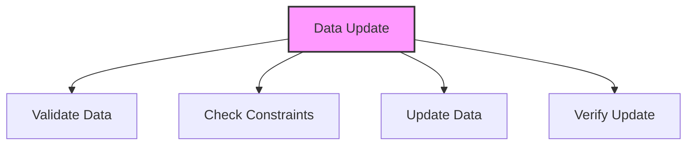

# SQL UPDATE Statement

## 🎯 Learning Outcomes
By the end of this overview, you will understand:
- How to update data in SQL
- UPDATE statement syntax
- Conditional updates
- Data validation
- Best practices for data modification

## 📚 Introduction
UPDATE Statement:
- Modifies existing data
- Supports conditional updates
- Handles data validation
- Maintains data integrity
- Essential for data management

## 🔄 Update Process


## 📊 Basic UPDATE Syntax
Update data in a table.

### Syntax
```sql
UPDATE table_name
SET column1 = value1, column2 = value2, ...
WHERE condition;
```

### Example
```sql
UPDATE Customers
SET Age = 31, Address = 'Boston'
WHERE ID = 1;
```

## 📈 Multiple Column Update
Update multiple columns in a single statement.

### Syntax
```sql
UPDATE table_name
SET 
    column1 = value1,
    column2 = value2,
    column3 = value3
WHERE condition;
```

### Example
```sql
UPDATE Employees
SET 
    Salary = 50000,
    Department = 'IT',
    LastUpdated = CURRENT_TIMESTAMP
WHERE EmployeeID = 100;
```

## 🔧 Conditional Updates
Update based on conditions.

### Syntax
```sql
UPDATE table_name
SET column = CASE
    WHEN condition1 THEN value1
    WHEN condition2 THEN value2
    ELSE value3
END
WHERE condition;
```

### Example
```sql
UPDATE Products
SET Price = CASE
    WHEN Category = 'Electronics' THEN Price * 1.1
    WHEN Category = 'Clothing' THEN Price * 0.9
    ELSE Price
END
WHERE Stock > 0;
```

## 🎯 Data Validation
Important considerations:
- Data type matching
- Constraint checking
- NULL handling
- Default values
- Unique constraints
- Foreign key rules
- Check constraints

## 🎓 Best Practices
1. Always use WHERE clause
2. Validate data before update
3. Use appropriate data types
4. Handle NULL values
5. Consider constraints
6. Use transactions
7. Document operations
8. Test thoroughly

## ⚠️ Common Errors
- Missing WHERE clause
- Data type mismatch
- Constraint violation
- NULL in NOT NULL
- Foreign key error
- Syntax error
- Permission denied

## 📝 Quick Summary
- UPDATE syntax
- Conditional updates
- Multiple column updates
- Data validation
- Constraint handling
- Error prevention
- Performance tips

## 🔍 Important Considerations
1. Data validation
2. Constraint checking
3. Performance impact
4. Transaction handling
5. Error management
6. Testing procedures
7. Documentation

## 💡 Tips
- Always use WHERE
- Validate data first
- Use appropriate types
- Handle constraints
- Consider performance
- Use transactions
- Test thoroughly
- Document process

---
*This overview provides a comprehensive understanding of SQL UPDATE Statement. For practical implementation and examples, refer to the hands-on sections of the course.* 