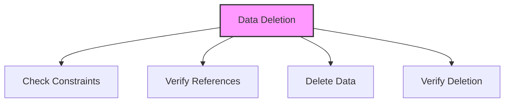

# SQL DELETE Statement

## 🎯 Learning Outcomes
By the end of this overview, you will understand:
- How to delete data in SQL
- DELETE statement syntax
- Conditional deletion
- Data integrity
- Best practices for data removal

## 📚 Introduction
DELETE Statement:
- Removes data from tables
- Supports conditional deletion
- Maintains referential integrity
- Essential for data management
- Handles cascading effects

## 🔄 Delete Process


## 📊 Basic DELETE Syntax
Delete data from a table.

### Syntax
```sql
DELETE FROM table_name
WHERE condition;
```

### Example
```sql
DELETE FROM Customers
WHERE ID = 1;
```

## 📈 Multiple Row Deletion
Delete multiple rows based on condition.

### Syntax
```sql
DELETE FROM table_name
WHERE condition1 AND condition2;
```

### Example
```sql
DELETE FROM Orders
WHERE OrderDate < '2023-01-01'
AND Status = 'Cancelled';
```

## 🔧 Cascading Deletion
Handle related records deletion.

### Syntax
```sql
-- Parent table
CREATE TABLE Parent (
    ID INT PRIMARY KEY
);

-- Child table with CASCADE
CREATE TABLE Child (
    ID INT PRIMARY KEY,
    ParentID INT,
    FOREIGN KEY (ParentID) 
    REFERENCES Parent(ID)
    ON DELETE CASCADE
);
```

## 🎯 Data Integrity
Important considerations:
- Referential integrity
- Cascade effects
- Constraint checking
- Transaction handling
- Backup procedures
- Recovery options
- Audit logging

## 🎓 Best Practices
1. Always use WHERE clause
2. Check dependencies first
3. Use transactions
4. Consider cascading
5. Backup data
6. Document operations
7. Test thoroughly
8. Verify results

## ⚠️ Common Errors
- Missing WHERE clause
- Constraint violation
- Foreign key error
- Permission denied
- Transaction deadlock
- Syntax error
- Resource limits

## 📝 Quick Summary
- DELETE syntax
- Conditional deletion
- Cascading effects
- Data integrity
- Constraint handling
- Error prevention
- Performance tips

## 🔍 Important Considerations
1. Data integrity
2. Constraint checking
3. Performance impact
4. Transaction handling
5. Error management
6. Testing procedures
7. Documentation

## 💡 Tips
- Always use WHERE
- Check dependencies
- Use transactions
- Consider cascading
- Backup data
- Test thoroughly
- Document process
- Verify results

---
*This overview provides a comprehensive understanding of SQL DELETE Statement. For practical implementation and examples, refer to the hands-on sections of the course.* 