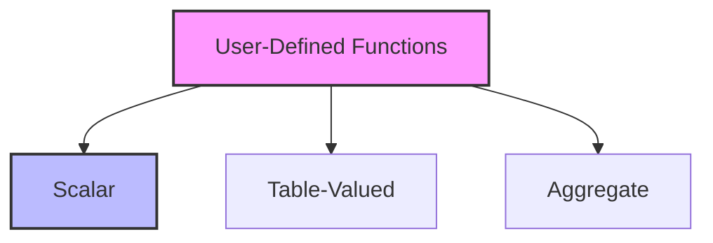

# SQL Functions (User-Defined): Customizing Your Data Logic

## Introduction: Why User-Defined Functions Matter
Imagine you're a chef who invents a new kitchen tool to make a unique dish—something not available in any store. User-defined functions (UDFs) in SQL are like these custom tools: they let you create reusable, specialized logic for your database, tailored to your exact needs.

---

## What are User-Defined SQL Functions?
**User-defined functions (UDFs)** are custom routines you create in SQL to encapsulate logic and return a value (or table). They help:
- Reuse complex calculations
- Simplify queries
- Enforce business rules
- Improve code maintainability
- Enhance modularity
- Support advanced data processing

---

## Types of SQL Functions (with Examples)

### 1. Scalar Functions
Return a single value.
```sql
-- Create a scalar function
CREATE FUNCTION GetFullName(
    first_name VARCHAR(50),
    last_name VARCHAR(50)
) RETURNS VARCHAR(101)
BEGIN
    RETURN CONCAT(first_name, ' ', last_name);
END;

-- Use in a query
SELECT GetFullName(first_name, last_name) AS full_name FROM employees;
```

### 2. Table-Valued Functions
Return a table (set of rows).
```sql
-- Create an inline table-valued function
CREATE FUNCTION GetHighEarners(min_salary DECIMAL(10,2))
RETURNS TABLE
RETURN (
    SELECT * FROM employees WHERE salary > min_salary
);

-- Use in a query
SELECT * FROM GetHighEarners(70000);
```

### 3. Aggregate Functions (Custom)
Perform custom aggregation logic.
```sql
-- Example (syntax varies by DBMS)
-- In PostgreSQL, you can define custom aggregates using CREATE AGGREGATE
-- In SQL Server, you can use CLR integration for custom aggregates
```

---

## Anatomy of a User-Defined Function
- **Input Parameters:** Values passed to the function
- **Return Type:** Scalar value or table
- **Function Body:** SQL logic (can include control flow, calculations, queries)
- **Determinism:** Should return the same result for the same input (for scalar functions)

---

## Visualizing Function Types


---

## Real-World Examples

### Example 1: Data Formatting
```sql
-- Function to format phone numbers
CREATE FUNCTION FormatPhoneNumber(phone VARCHAR(20))
RETURNS VARCHAR(20)
BEGIN
    RETURN CONCAT('(', SUBSTRING(phone, 1, 3), ') ', SUBSTRING(phone, 4, 3), '-', SUBSTRING(phone, 7, 4));
END;

SELECT FormatPhoneNumber('1234567890') AS formatted_phone;
```

### Example 2: Business Logic
```sql
-- Function to calculate discount
CREATE FUNCTION CalculateDiscount(amount DECIMAL(10,2), customer_type VARCHAR(20))
RETURNS DECIMAL(10,2)
BEGIN
    RETURN CASE 
        WHEN customer_type = 'Gold' THEN amount * 0.8
        WHEN customer_type = 'Silver' THEN amount * 0.9
        ELSE amount
    END;
END;

SELECT order_id, CalculateDiscount(total_amount, membership_level) AS discounted_amount
FROM orders;
```

### Example 3: Table-Valued Function for Reporting
```sql
-- Function to get recent orders for a customer
CREATE FUNCTION GetRecentOrders(customer_id INT)
RETURNS TABLE
RETURN (
    SELECT * FROM orders WHERE customer_id = customer_id AND order_date >= DATE_SUB(CURRENT_DATE, INTERVAL 30 DAY)
);

SELECT * FROM GetRecentOrders(1001);
```

---

## Best Practices & Key Takeaways
- Keep functions focused and simple
- Avoid side effects (do not modify data in scalar functions)
- Document function purpose and usage
- Test with various input scenarios
- Use meaningful names and parameters
- Consider performance and determinism

---

## Common Pitfalls to Avoid
- Overcomplicating functions
- Using functions in performance-critical queries without testing
- Not handling NULL values
- Failing to document logic
- Ignoring security (e.g., SQL injection in dynamic SQL)

---

## Further Exploration
- "SQL Server User-Defined Functions" by Itzik Ben-Gan
- "PostgreSQL: Up and Running" by Regina Obe
- Practice on Mode Analytics or SQLZoo

---
*This guide is designed to make user-defined SQL functions clear and practical for everyone. For hands-on practice, refer to the exercises and projects in the course materials.* 