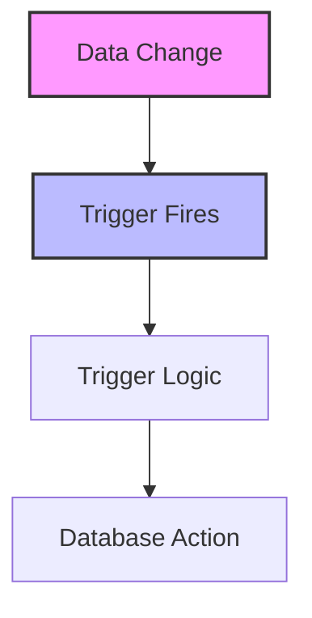

# SQL Triggers: Automating Reactions to Data Changes

## Introduction: Why Triggers Matter
Imagine a smart home where the lights turn on automatically when you enter a room. SQL triggers are like these smart sensors—they automatically execute actions in response to specific changes in your database, helping you enforce rules, maintain data integrity, and automate workflows.

---

## What are SQL Triggers?
**SQL triggers** are special procedures that automatically execute in response to certain events on a table or view. They help:
- Enforce business rules
- Maintain data integrity
- Automate auditing and logging
- Cascade changes
- Prevent invalid operations
- Simplify application logic

---

## Types of SQL Triggers (with Examples)

### 1. BEFORE Triggers
Executed before an INSERT, UPDATE, or DELETE operation.
```sql
-- Before insert trigger
CREATE TRIGGER before_insert_employee
BEFORE INSERT ON employees
FOR EACH ROW
BEGIN
    SET NEW.hire_date = CURRENT_DATE;
END;
```

### 2. AFTER Triggers
Executed after an INSERT, UPDATE, or DELETE operation.
```sql
-- After update trigger
CREATE TRIGGER after_update_salary
AFTER UPDATE ON employees
FOR EACH ROW
BEGIN
    INSERT INTO salary_audit (employee_id, old_salary, new_salary, change_date)
    VALUES (NEW.employee_id, OLD.salary, NEW.salary, CURRENT_TIMESTAMP);
END;
```

### 3. INSTEAD OF Triggers
Used on views to override default behavior (supported in some DBMS).
```sql
-- Instead of trigger (SQL Server example)
CREATE TRIGGER trg_instead_of_update
ON employee_view
INSTEAD OF UPDATE
AS
BEGIN
    UPDATE employees
    SET salary = inserted.salary
    FROM inserted
    WHERE employees.employee_id = inserted.employee_id;
END;
```

---

## Anatomy of a Trigger
- **Event:** INSERT, UPDATE, or DELETE
- **Timing:** BEFORE, AFTER, or INSTEAD OF
- **Scope:** FOR EACH ROW or FOR EACH STATEMENT
- **Trigger Body:** SQL logic to execute

---

## Visualizing Trigger Flow


---

## Real-World Examples

### Example 1: Auditing Changes
```sql
-- Audit log for employee deletions
CREATE TRIGGER audit_employee_delete
AFTER DELETE ON employees
FOR EACH ROW
BEGIN
    INSERT INTO employee_audit (employee_id, action, action_date)
    VALUES (OLD.employee_id, 'DELETE', CURRENT_TIMESTAMP);
END;
```

### Example 2: Enforcing Business Rules
```sql
-- Prevent negative inventory
CREATE TRIGGER prevent_negative_inventory
BEFORE UPDATE ON products
FOR EACH ROW
BEGIN
    IF NEW.stock_quantity < 0 THEN
        SIGNAL SQLSTATE '45000' SET MESSAGE_TEXT = 'Stock cannot be negative';
    END IF;
END;
```

### Example 3: Cascading Updates
```sql
-- Update related records automatically
CREATE TRIGGER update_order_status
AFTER UPDATE ON orders
FOR EACH ROW
BEGIN
    IF NEW.status = 'Shipped' THEN
        UPDATE shipments
        SET shipped_date = CURRENT_DATE
        WHERE order_id = NEW.order_id;
    END IF;
END;
```

---

## Best Practices & Key Takeaways
- Use triggers for enforcing rules and automation
- Keep trigger logic simple and efficient
- Document trigger purpose and behavior
- Test thoroughly for side effects
- Monitor trigger performance
- Avoid complex or nested triggers

---

## Common Pitfalls to Avoid
- Overusing triggers for business logic
- Creating recursive or mutually dependent triggers
- Ignoring performance impact
- Failing to document triggers
- Making triggers too complex
- Not handling errors properly

---

## Further Exploration
- "SQL Server Triggers" by Itzik Ben-Gan
- "MySQL Cookbook" by Paul DuBois
- Practice on Mode Analytics or SQLZoo

---
*This guide is designed to make SQL triggers clear and practical for everyone. For hands-on practice, refer to the exercises and projects in the course materials.* 