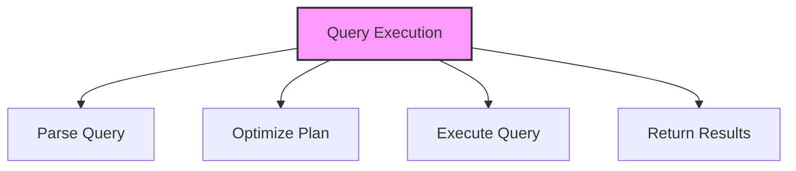

# SQL SELECT Statement

## 🎯 Learning Outcomes
By the end of this overview, you will understand:
- How to query data in SQL
- SELECT statement syntax
- Basic and advanced queries
- Data filtering and sorting
- Best practices for data retrieval

## 📚 Introduction
SELECT Statement:
- Retrieves data from tables
- Supports complex queries
- Enables data filtering
- Allows data sorting
- Essential for data analysis

## 🔄 Query Process


## 📊 Basic SELECT Syntax
Retrieve data from a table.

### Syntax
```sql
SELECT column1, column2, ...
FROM table_name
WHERE condition;
```

### Example
```sql
SELECT ID, Name, Age
FROM Customers
WHERE Age > 30;
```

## 📈 Advanced SELECT Features

### 1. Column Selection
```sql
-- All columns
SELECT * FROM table_name;

-- Specific columns
SELECT column1, column2 FROM table_name;

-- Calculated columns
SELECT column1, column2 * 1.1 AS new_column
FROM table_name;
```

### 2. Filtering
```sql
-- Basic WHERE
SELECT * FROM table_name
WHERE condition;

-- Multiple conditions
SELECT * FROM table_name
WHERE condition1 AND condition2;

-- IN operator
SELECT * FROM table_name
WHERE column IN (value1, value2, ...);

-- LIKE operator
SELECT * FROM table_name
WHERE column LIKE pattern;
```

### 3. Sorting
```sql
-- Basic ORDER BY
SELECT * FROM table_name
ORDER BY column;

-- Multiple columns
SELECT * FROM table_name
ORDER BY column1, column2;

-- Ascending/Descending
SELECT * FROM table_name
ORDER BY column DESC;
```

### 4. Aggregation
```sql
-- Basic aggregation
SELECT 
    COUNT(*),
    SUM(column),
    AVG(column),
    MAX(column),
    MIN(column)
FROM table_name
GROUP BY column;
```

## 🔧 Common Clauses

### 1. WHERE
- Filter rows
- Use conditions
- Combine with AND/OR
- Support operators

### 2. GROUP BY
- Group results
- Use with aggregates
- Multiple columns
- Having clause

### 3. HAVING
- Filter groups
- Use with aggregates
- After GROUP BY
- Complex conditions

### 4. ORDER BY
- Sort results
- Multiple columns
- ASC/DESC
- NULL handling

## 🎯 Query Optimization
Important considerations:
- Index usage
- Join optimization
- Subquery handling
- Execution plan
- Resource usage
- Performance impact
- Cache utilization

## 🎓 Best Practices
1. Use specific columns
2. Optimize WHERE clauses
3. Use appropriate indexes
4. Limit result sets
5. Use proper joins
6. Document queries
7. Test performance
8. Monitor execution

## ⚠️ Common Errors
- Syntax errors
- Missing conditions
- Incorrect joins
- Performance issues
- Resource limits
- Permission denied
- Data type mismatch

## 📝 Quick Summary
- SELECT syntax
- Basic queries
- Advanced features
- Query optimization
- Performance tips
- Error prevention
- Best practices

## 🔍 Important Considerations
1. Query performance
2. Data accuracy
3. Resource usage
4. Security
5. Maintenance
6. Documentation
7. Testing

## 💡 Tips
- Use specific columns
- Optimize queries
- Use indexes
- Limit results
- Test thoroughly
- Document process
- Monitor performance

---
*This overview provides a comprehensive understanding of SQL SELECT Statement. For practical implementation and examples, refer to the hands-on sections of the course.* 