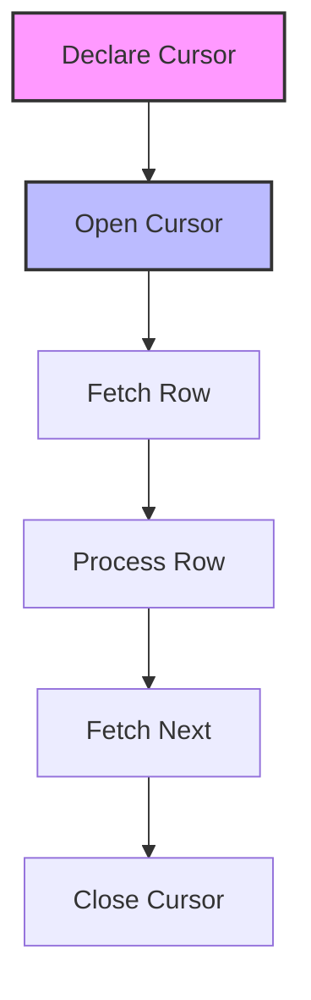

# SQL Cursors: Navigating Data Row by Row

## Introduction: Why Cursors Matter
Imagine reading a book one page at a time, making notes as you go. SQL cursors let you process query results one row at a time, giving you fine-grained control for complex operations that can't be done with set-based SQL alone. They're essential for advanced data manipulation, reporting, and automation.

---

## What are SQL Cursors?
**SQL cursors** are database objects that allow you to retrieve, navigate, and manipulate query results row by row. They help:
- Process data sequentially
- Perform row-by-row operations
- Implement complex business logic
- Automate batch updates
- Generate custom reports
- Handle procedural tasks

---

## Types of SQL Cursors (with Examples)

### 1. Implicit Cursors
Automatically created by the database for single SQL statements.
```sql
-- Example: Using implicit cursor in PL/SQL
BEGIN
    UPDATE employees SET salary = salary * 1.1 WHERE department = 'IT';
    IF SQL%ROWCOUNT > 0 THEN
        DBMS_OUTPUT.PUT_LINE('Salaries updated!');
    END IF;
END;
```

### 2. Explicit Cursors
Defined and controlled by the user for complex operations.
```sql
-- Declare, open, fetch, and close an explicit cursor
DECLARE
    CURSOR emp_cursor IS
        SELECT employee_id, salary FROM employees WHERE department = 'IT';
    emp_record employees%ROWTYPE;
BEGIN
    OPEN emp_cursor;
    LOOP
        FETCH emp_cursor INTO emp_record;
        EXIT WHEN emp_cursor%NOTFOUND;
        -- Process each row
        DBMS_OUTPUT.PUT_LINE('Employee ID: ' || emp_record.employee_id || ', Salary: ' || emp_record.salary);
    END LOOP;
    CLOSE emp_cursor;
END;
```

### 3. Parameterized Cursors
Accept parameters to filter data dynamically.
```sql
-- Cursor with parameter
DECLARE
    CURSOR dept_cursor(dept_name VARCHAR) IS
        SELECT employee_id, salary FROM employees WHERE department = dept_name;
    emp_record employees%ROWTYPE;
BEGIN
    OPEN dept_cursor('HR');
    LOOP
        FETCH dept_cursor INTO emp_record;
        EXIT WHEN dept_cursor%NOTFOUND;
        -- Process each row
        DBMS_OUTPUT.PUT_LINE('Employee ID: ' || emp_record.employee_id);
    END LOOP;
    CLOSE dept_cursor;
END;
```

### 4. Scrollable Cursors
Allow moving forward and backward through the result set (supported in some DBMS).
```sql
-- Example (SQL Server)
DECLARE emp_cursor CURSOR SCROLL FOR
    SELECT employee_id, salary FROM employees;
OPEN emp_cursor;
FETCH NEXT FROM emp_cursor;
FETCH PRIOR FROM emp_cursor;
CLOSE emp_cursor;
DEALLOCATE emp_cursor;
```

---

## Anatomy of a Cursor
- **Declaration:** Define the cursor and its query
- **Opening:** Allocate resources and execute the query
- **Fetching:** Retrieve rows one at a time
- **Processing:** Perform logic on each row
- **Closing:** Release resources

---

## Visualizing Cursor Workflow


---

## Real-World Examples

### Example 1: Batch Salary Update
```sql
-- Increase salary for each employee in IT by 10%
DECLARE
    CURSOR it_cursor IS
        SELECT employee_id, salary FROM employees WHERE department = 'IT';
    emp_id employees.employee_id%TYPE;
    emp_salary employees.salary%TYPE;
BEGIN
    OPEN it_cursor;
    LOOP
        FETCH it_cursor INTO emp_id, emp_salary;
        EXIT WHEN it_cursor%NOTFOUND;
        UPDATE employees SET salary = emp_salary * 1.1 WHERE employee_id = emp_id;
    END LOOP;
    CLOSE it_cursor;
END;
```

### Example 2: Generating Custom Reports
```sql
-- Generate a report of employees with bonuses
DECLARE
    CURSOR bonus_cursor IS
        SELECT employee_id, salary FROM employees WHERE bonus > 0;
    emp_id employees.employee_id%TYPE;
    emp_salary employees.salary%TYPE;
BEGIN
    OPEN bonus_cursor;
    LOOP
        FETCH bonus_cursor INTO emp_id, emp_salary;
        EXIT WHEN bonus_cursor%NOTFOUND;
        DBMS_OUTPUT.PUT_LINE('Employee ID: ' || emp_id || ', Salary: ' || emp_salary);
    END LOOP;
    CLOSE bonus_cursor;
END;
```

---

## Best Practices & Key Takeaways
- Use cursors only when set-based operations are insufficient
- Keep cursor logic simple and efficient
- Always close cursors to free resources
- Document cursor purpose and usage
- Test for performance and scalability
- Avoid unnecessary row-by-row processing

---

## Common Pitfalls to Avoid
- Overusing cursors (prefer set-based SQL)
- Forgetting to close cursors
- Creating nested or recursive cursors
- Ignoring performance impact
- Not handling exceptions
- Making cursors too complex

---

## Further Exploration
- "Oracle PL/SQL Programming" by Steven Feuerstein
- "SQL Server T-SQL Programming" by Itzik Ben-Gan
- Practice on Mode Analytics or SQLZoo

---
*This guide is designed to make SQL cursors clear and practical for everyone. For hands-on practice, refer to the exercises and projects in the course materials.* 