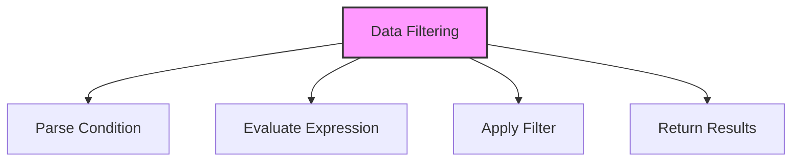

# SQL WHERE Clause

## 🎯 Learning Outcomes
By the end of this overview, you will understand:
- How to filter data in SQL
- WHERE clause syntax
- Comparison operators
- Logical operators
- Best practices for data filtering

## 📚 Introduction
WHERE Clause:
- Filters rows in queries
- Supports conditions
- Enables data selection
- Essential for data filtering
- Maintains data integrity

## 🔄 Filtering Process


## 📊 Basic WHERE Syntax
Filter data using conditions.

### Syntax
```sql
SELECT column1, column2, ...
FROM table_name
WHERE condition;
```

### Example
```sql
SELECT * FROM Customers
WHERE Age > 30;
```

## 📈 Comparison Operators

### 1. Basic Operators
```sql
-- Equal to
WHERE column = value

-- Not equal to
WHERE column != value

-- Greater than
WHERE column > value

-- Less than
WHERE column < value

-- Greater than or equal
WHERE column >= value

-- Less than or equal
WHERE column <= value
```

### 2. Special Operators
```sql
-- BETWEEN
WHERE column BETWEEN value1 AND value2

-- IN
WHERE column IN (value1, value2, ...)

-- LIKE
WHERE column LIKE pattern

-- IS NULL
WHERE column IS NULL

-- IS NOT NULL
WHERE column IS NOT NULL
```

## 🔧 Logical Operators

### 1. AND
```sql
WHERE condition1 AND condition2
```

### 2. OR
```sql
WHERE condition1 OR condition2
```

### 3. NOT
```sql
WHERE NOT condition
```

### 4. Combined Operators
```sql
WHERE (condition1 AND condition2) OR (condition3 AND condition4)
```

## 🎯 Pattern Matching
Using LIKE operator:

### 1. Basic Patterns
```sql
-- Starts with
WHERE column LIKE 'A%'

-- Ends with
WHERE column LIKE '%A'

-- Contains
WHERE column LIKE '%A%'

-- Single character
WHERE column LIKE 'A_'

-- Multiple characters
WHERE column LIKE 'A__'
```

### 2. Escape Characters
```sql
WHERE column LIKE '100\%' ESCAPE '\'
```

## 🎓 Best Practices
1. Use indexes effectively
2. Optimize conditions
3. Use appropriate operators
4. Handle NULL values
5. Consider performance
6. Document conditions
7. Test thoroughly
8. Monitor execution

## ⚠️ Common Errors
- Syntax errors
- Operator misuse
- NULL handling
- Performance issues
- Index usage
- Data type mismatch
- Logical errors

## 📝 Quick Summary
- WHERE syntax
- Comparison operators
- Logical operators
- Pattern matching
- NULL handling
- Performance tips
- Best practices

## 🔍 Important Considerations
1. Query performance
2. Data accuracy
3. Index usage
4. NULL handling
5. Pattern matching
6. Documentation
7. Testing

## 💡 Tips
- Use indexes
- Optimize conditions
- Handle NULL properly
- Use appropriate operators
- Test thoroughly
- Document process
- Monitor performance

---
*This overview provides a comprehensive understanding of SQL WHERE Clause. For practical implementation and examples, refer to the hands-on sections of the course.* 