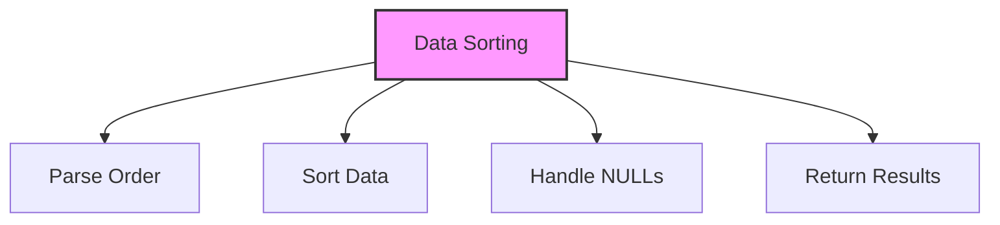

# SQL ORDER BY Clause

## 🎯 Learning Outcomes
By the end of this overview, you will understand:
- How to sort data in SQL
- ORDER BY clause syntax
- Sorting directions
- Multiple column sorting
- Best practices for data ordering

## 📚 Introduction
ORDER BY Clause:
- Sorts query results
- Supports ascending/descending
- Multiple column sorting
- NULL value handling
- Essential for data presentation

## 🔄 Sorting Process


## 📊 Basic ORDER BY Syntax
Sort data using columns.

### Syntax
```sql
SELECT column1, column2, ...
FROM table_name
ORDER BY column1 [ASC|DESC];
```

### Example
```sql
SELECT * FROM Customers
ORDER BY Age DESC;
```

## 📈 Sorting Directions

### 1. Ascending Order (Default)
```sql
-- Explicit
ORDER BY column ASC

-- Implicit
ORDER BY column
```

### 2. Descending Order
```sql
ORDER BY column DESC
```

## 🔧 Multiple Column Sorting

### 1. Basic Multiple Sort
```sql
ORDER BY column1, column2
```

### 2. Mixed Directions
```sql
ORDER BY column1 ASC, column2 DESC
```

### 3. Expression Sorting
```sql
ORDER BY expression
```

## 🎯 NULL Value Handling

### 1. NULLS FIRST
```sql
ORDER BY column NULLS FIRST
```

### 2. NULLS LAST
```sql
ORDER BY column NULLS LAST
```

## 📊 Common Sorting Patterns

### 1. Alphabetical Order
```sql
ORDER BY Name ASC
```

### 2. Numerical Order
```sql
ORDER BY Age DESC
```

### 3. Date Order
```sql
ORDER BY Date ASC
```

### 4. Custom Order
```sql
ORDER BY 
    CASE 
        WHEN Status = 'Active' THEN 1
        WHEN Status = 'Pending' THEN 2
        ELSE 3
    END
```

## 🎓 Best Practices
1. Use appropriate indexes
2. Consider performance
3. Handle NULL values
4. Use clear directions
5. Document sorting
6. Test thoroughly
7. Monitor execution
8. Optimize queries

## ⚠️ Common Errors
- Syntax errors
- Performance issues
- NULL handling
- Index usage
- Data type mismatch
- Logical errors
- Resource limits

## 📝 Quick Summary
- ORDER BY syntax
- Sorting directions
- Multiple columns
- NULL handling
- Performance tips
- Best practices
- Common patterns

## 🔍 Important Considerations
1. Query performance
2. Data accuracy
3. Index usage
4. NULL handling
5. Sorting logic
6. Documentation
7. Testing

## 💡 Tips
- Use indexes
- Handle NULL properly
- Consider performance
- Use clear directions
- Test thoroughly
- Document process
- Monitor execution

---
*This overview provides a comprehensive understanding of SQL ORDER BY Clause. For practical implementation and examples, refer to the hands-on sections of the course.* 