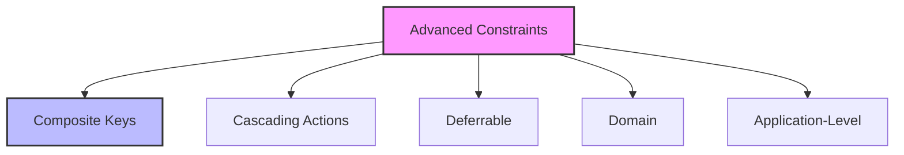

# SQL Constraints (Advanced): Mastering Data Integrity and Business Rules

## Introduction: Why Advanced Constraints Matter
Imagine a high-security vault with multiple layers of locks, alarms, and access codes. Advanced SQL constraints are like these extra layers of protection—they enforce complex business rules, prevent data anomalies, and ensure your database remains trustworthy and robust, even as requirements grow.

---

## What are Advanced SQL Constraints?
**Advanced SQL constraints** go beyond the basics (PRIMARY KEY, FOREIGN KEY, UNIQUE, NOT NULL, CHECK) to enforce sophisticated rules and relationships. They help:
- Enforce complex business logic
- Maintain referential and domain integrity
- Prevent data anomalies
- Support regulatory compliance
- Automate data validation
- Simplify application code

---

## Types of Advanced Constraints (with Examples)

### 1. Composite Primary Keys
```sql
-- Composite primary key on two columns
CREATE TABLE enrollments (
    student_id INT,
    course_id INT,
    enrollment_date DATE,
    PRIMARY KEY (student_id, course_id)
);
```

### 2. Composite Unique Constraints
```sql
-- Unique combination of columns
CREATE TABLE employees (
    employee_id INT PRIMARY KEY,
    department_id INT,
    email VARCHAR(100),
    UNIQUE (department_id, email)
);
```

### 3. Cascading Actions (ON DELETE/UPDATE)
```sql
-- Foreign key with cascading delete
CREATE TABLE orders (
    order_id INT PRIMARY KEY,
    customer_id INT,
    FOREIGN KEY (customer_id) REFERENCES customers(customer_id)
        ON DELETE CASCADE
);

-- Foreign key with cascading update
CREATE TABLE order_items (
    order_item_id INT PRIMARY KEY,
    order_id INT,
    FOREIGN KEY (order_id) REFERENCES orders(order_id)
        ON UPDATE CASCADE
);
```

### 4. Deferrable Constraints
```sql
-- Deferrable constraint (PostgreSQL example)
CREATE TABLE payments (
    payment_id INT PRIMARY KEY,
    order_id INT,
    amount DECIMAL(10,2),
    CONSTRAINT fk_order
        FOREIGN KEY (order_id)
        REFERENCES orders(order_id)
        DEFERRABLE INITIALLY DEFERRED
);
```

### 5. Domain Constraints (Custom Data Types)
```sql
-- Domain constraint using custom type (PostgreSQL)
CREATE DOMAIN positive_amount AS DECIMAL(10,2)
    CHECK (VALUE > 0);

CREATE TABLE transactions (
    transaction_id INT PRIMARY KEY,
    amount positive_amount
);
```

### 6. Application-Level Constraints (Enforced via Triggers or Procedures)
```sql
-- Enforcing business rule with trigger
CREATE TRIGGER prevent_duplicate_salary
BEFORE INSERT ON employees
FOR EACH ROW
BEGIN
    IF EXISTS (
        SELECT 1 FROM employees WHERE salary = NEW.salary AND department = NEW.department
    ) THEN
        SIGNAL SQLSTATE '45000' SET MESSAGE_TEXT = 'Duplicate salary in department not allowed';
    END IF;
END;
```

---

## Visualizing Advanced Constraint Relationships


---

## Real-World Examples

### Example 1: University Enrollment System
```sql
-- Prevent duplicate enrollments
CREATE TABLE enrollments (
    student_id INT,
    course_id INT,
    enrollment_date DATE,
    PRIMARY KEY (student_id, course_id)
);

-- Cascade delete enrollments if student is removed
CREATE TABLE students (
    student_id INT PRIMARY KEY,
    name VARCHAR(100)
);

ALTER TABLE enrollments
ADD CONSTRAINT fk_student
FOREIGN KEY (student_id) REFERENCES students(student_id)
ON DELETE CASCADE;
```

### Example 2: Financial Transactions
```sql
-- Enforce positive amounts and deferred checks
CREATE DOMAIN positive_amount AS DECIMAL(10,2)
    CHECK (VALUE > 0);

CREATE TABLE transactions (
    transaction_id INT PRIMARY KEY,
    amount positive_amount,
    order_id INT,
    CONSTRAINT fk_order FOREIGN KEY (order_id)
        REFERENCES orders(order_id)
        DEFERRABLE INITIALLY DEFERRED
);
```

---

## Best Practices & Key Takeaways
- Use advanced constraints for complex business rules
- Document constraint logic and purpose
- Test with edge cases and large data sets
- Monitor constraint performance
- Combine constraints with triggers/procedures as needed
- Review constraints regularly as requirements evolve

---

## Common Pitfalls to Avoid
- Over-constraining tables
- Ignoring performance impact
- Failing to document complex logic
- Relying solely on application code for validation
- Not testing with real-world scenarios

---

## Further Exploration
- "SQL Antipatterns" by Bill Karwin
- "Database Design for Mere Mortals" by Michael J. Hernandez
- Practice on Mode Analytics or SQLZoo

---
*This guide is designed to make advanced SQL constraints clear and practical for everyone. For hands-on practice, refer to the exercises and projects in the course materials.* 