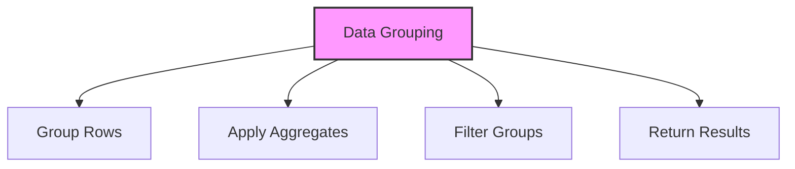

# SQL GROUP BY Clause

## 🎯 Learning Outcomes
By the end of this overview, you will understand:
- How to group data in SQL
- GROUP BY clause syntax
- Aggregation functions
- HAVING clause usage
- Best practices for data grouping

## 📚 Introduction
GROUP BY Clause:
- Groups rows by columns
- Supports aggregation
- Enables data analysis
- Essential for reporting
- Maintains data integrity

## 🔄 Grouping Process


## 📊 Basic GROUP BY Syntax
Group data using columns.

### Syntax
```sql
SELECT column1, aggregate_function(column2)
FROM table_name
GROUP BY column1;
```

### Example
```sql
SELECT Department, COUNT(*) as EmployeeCount
FROM Employees
GROUP BY Department;
```

## 📈 Aggregation Functions

### 1. Basic Aggregates
```sql
-- Count
COUNT(column)

-- Sum
SUM(column)

-- Average
AVG(column)

-- Maximum
MAX(column)

-- Minimum
MIN(column)
```

### 2. Advanced Aggregates
```sql
-- Standard Deviation
STDDEV(column)

-- Variance
VARIANCE(column)

-- Median
MEDIAN(column)

-- Mode
MODE(column)
```

## 🔧 HAVING Clause

### 1. Basic HAVING
```sql
SELECT column1, aggregate_function(column2)
FROM table_name
GROUP BY column1
HAVING aggregate_function(column2) condition;
```

### 2. Multiple Conditions
```sql
SELECT column1, aggregate_function(column2)
FROM table_name
GROUP BY column1
HAVING condition1 AND condition2;
```

## 🎯 Common Grouping Patterns

### 1. Basic Grouping
```sql
SELECT column1, COUNT(*)
FROM table_name
GROUP BY column1;
```

### 2. Multiple Columns
```sql
SELECT column1, column2, COUNT(*)
FROM table_name
GROUP BY column1, column2;
```

### 3. With WHERE
```sql
SELECT column1, COUNT(*)
FROM table_name
WHERE condition
GROUP BY column1;
```

### 4. With HAVING
```sql
SELECT column1, COUNT(*)
FROM table_name
GROUP BY column1
HAVING COUNT(*) > 1;
```

## 🎓 Best Practices
1. Use appropriate indexes
2. Consider performance
3. Handle NULL values
4. Use clear grouping
5. Document queries
6. Test thoroughly
7. Monitor execution
8. Optimize queries

## ⚠️ Common Errors
- Syntax errors
- Performance issues
- NULL handling
- Index usage
- Data type mismatch
- Logical errors
- Resource limits

## 📝 Quick Summary
- GROUP BY syntax
- Aggregation functions
- HAVING clause
- Performance tips
- Best practices
- Common patterns
- Error prevention

## 🔍 Important Considerations
1. Query performance
2. Data accuracy
3. Index usage
4. NULL handling
5. Grouping logic
6. Documentation
7. Testing

## 💡 Tips
- Use indexes
- Handle NULL properly
- Consider performance
- Use clear grouping
- Test thoroughly
- Document process
- Monitor execution

---
*This overview provides a comprehensive understanding of SQL GROUP BY Clause. For practical implementation and examples, refer to the hands-on sections of the course.* 