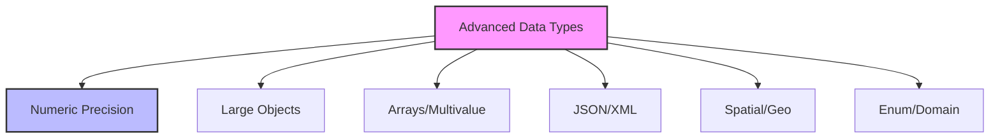

# SQL Data Types (Advanced): Precision, Performance, and Practicality

## Introduction: Why Advanced Data Types Matter
Imagine building a spaceship—you need the right materials for each part, not just generic metal. Advanced SQL data types are like specialized materials: they let you store, process, and protect your data with precision, efficiency, and clarity. Mastering data types is key to building robust, high-performance databases.

---

## What are Advanced SQL Data Types?
**Advanced SQL data types** go beyond the basics (INT, VARCHAR, DATE) to support complex, high-precision, and specialized data. They help:
- Store complex structures (arrays, JSON, XML)
- Handle high-precision numbers (DECIMAL, NUMERIC)
- Manage large objects (BLOB, CLOB)
- Support spatial and geographic data (GEOMETRY, POINT)
- Enable custom domains and enumerations
- Optimize storage and performance

---

## Types of Advanced Data Types (with Examples)

### 1. Numeric Precision Types
```sql
-- High-precision numbers
CREATE TABLE financials (
    transaction_id INT PRIMARY KEY,
    amount DECIMAL(20,8),
    interest_rate NUMERIC(5,4)
);
```

### 2. Large Object Types (LOBs)
```sql
-- Binary and character large objects
CREATE TABLE documents (
    doc_id INT PRIMARY KEY,
    doc_name VARCHAR(255),
    content BLOB,
    description CLOB
);
```

### 3. Array and Multivalue Types
```sql
-- Array type (PostgreSQL example)
CREATE TABLE survey_responses (
    response_id SERIAL PRIMARY KEY,
    answers TEXT[]
);

-- Multivalue (MySQL SET type)
CREATE TABLE user_roles (
    user_id INT PRIMARY KEY,
    roles SET('admin', 'editor', 'viewer')
);
```

### 4. JSON and XML Types
```sql
-- JSON data
CREATE TABLE api_logs (
    log_id INT PRIMARY KEY,
    request_data JSON,
    response_data JSON
);

-- XML data
CREATE TABLE xml_store (
    id INT PRIMARY KEY,
    data XML
);
```

### 5. Spatial and Geographic Types
```sql
-- Geometry and point types (PostgreSQL/PostGIS example)
CREATE TABLE locations (
    location_id SERIAL PRIMARY KEY,
    name VARCHAR(100),
    coordinates GEOMETRY(Point, 4326)
);
```

### 6. Enumerated and Domain Types
```sql
-- Enum type (PostgreSQL example)
CREATE TYPE mood AS ENUM ('happy', 'sad', 'neutral');
CREATE TABLE people (
    person_id SERIAL PRIMARY KEY,
    name VARCHAR(100),
    current_mood mood
);

-- Domain type
CREATE DOMAIN positive_int AS INT CHECK (VALUE > 0);
CREATE TABLE inventory (
    item_id INT PRIMARY KEY,
    quantity positive_int
);
```

---

## Visualizing Data Type Categories


---

## Real-World Examples

### Example 1: Financial Systems
```sql
-- High-precision and JSON data
CREATE TABLE transactions (
    transaction_id INT PRIMARY KEY,
    amount DECIMAL(18,6),
    metadata JSON
);
```

### Example 2: Geographic Information Systems (GIS)
```sql
-- Storing spatial data
CREATE TABLE cities (
    city_id SERIAL PRIMARY KEY,
    name VARCHAR(100),
    location GEOMETRY(Point, 4326)
);
```

### Example 3: Document Management
```sql
-- Storing large documents
CREATE TABLE files (
    file_id INT PRIMARY KEY,
    file_name VARCHAR(255),
    file_data BLOB
);
```

---

## Best Practices & Key Takeaways
- Choose the most precise and efficient type for your data
- Use advanced types for complex or structured data
- Document data type choices and constraints
- Test for compatibility and performance
- Avoid overusing generic types (e.g., VARCHAR for everything)
- Leverage database-specific features (e.g., PostGIS, JSONB)

---

## Common Pitfalls to Avoid
- Using imprecise types for critical data
- Ignoring storage and performance impact
- Failing to validate structured data (JSON/XML)
- Overcomplicating schema with unnecessary types
- Not documenting custom types/domains

---

## Further Exploration
- "SQL in a Nutshell" by Kevin Kline
- "PostgreSQL: Up and Running" by Regina Obe
- Practice on Mode Analytics or SQLZoo

---
*This guide is designed to make advanced SQL data types clear and practical for everyone. For hands-on practice, refer to the exercises and projects in the course materials.* 