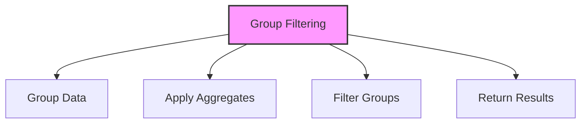

# SQL HAVING Clause

## 🎯 Learning Outcomes
By the end of this overview, you will understand:
- How to filter grouped data in SQL
- HAVING clause syntax
- Difference from WHERE
- Aggregation filtering
- Best practices for group filtering

## 📚 Introduction
HAVING Clause:
- Filters grouped data
- Works with aggregates
- Supports conditions
- Essential for analysis
- Maintains data integrity

## 🔄 Filtering Process


## 📊 Basic HAVING Syntax
Filter grouped data using conditions.

### Syntax
```sql
SELECT column1, aggregate_function(column2)
FROM table_name
GROUP BY column1
HAVING aggregate_function(column2) condition;
```

### Example
```sql
SELECT Department, COUNT(*) as EmployeeCount
FROM Employees
GROUP BY Department
HAVING COUNT(*) > 5;
```

## 📈 Common HAVING Patterns

### 1. Basic Filtering
```sql
-- Count condition
HAVING COUNT(*) > 1

-- Sum condition
HAVING SUM(column) > 1000

-- Average condition
HAVING AVG(column) > 50

-- Maximum condition
HAVING MAX(column) > 100

-- Minimum condition
HAVING MIN(column) < 10
```

### 2. Multiple Conditions
```sql
HAVING COUNT(*) > 1 AND AVG(column) > 50
```

### 3. Complex Conditions
```sql
HAVING (COUNT(*) > 1 OR SUM(column) > 1000)
AND AVG(column) > 50
```

## 🔧 HAVING vs WHERE

### 1. WHERE Clause
- Filters individual rows
- Applied before grouping
- Cannot use aggregates
- Better performance

### 2. HAVING Clause
- Filters grouped rows
- Applied after grouping
- Can use aggregates
- More flexible

## 🎯 Common Use Cases

### 1. Finding Duplicates
```sql
SELECT column1, COUNT(*)
FROM table_name
GROUP BY column1
HAVING COUNT(*) > 1;
```

### 2. Threshold Analysis
```sql
SELECT Department, AVG(Salary)
FROM Employees
GROUP BY Department
HAVING AVG(Salary) > 50000;
```

### 3. Data Quality
```sql
SELECT column1, COUNT(*)
FROM table_name
GROUP BY column1
HAVING COUNT(*) < 10;
```

## 🎓 Best Practices
1. Use appropriate indexes
2. Consider performance
3. Handle NULL values
4. Use clear conditions
5. Document queries
6. Test thoroughly
7. Monitor execution
8. Optimize queries

## ⚠️ Common Errors
- Syntax errors
- Performance issues
- NULL handling
- Index usage
- Data type mismatch
- Logical errors
- Resource limits

## 📝 Quick Summary
- HAVING syntax
- Common patterns
- Performance tips
- Best practices
- Error prevention
- Use cases
- Optimization

## 🔍 Important Considerations
1. Query performance
2. Data accuracy
3. Index usage
4. NULL handling
5. Filtering logic
6. Documentation
7. Testing

## 💡 Tips
- Use indexes
- Handle NULL properly
- Consider performance
- Use clear conditions
- Test thoroughly
- Document process
- Monitor execution

---
*This overview provides a comprehensive understanding of SQL HAVING Clause. For practical implementation and examples, refer to the hands-on sections of the course.* 