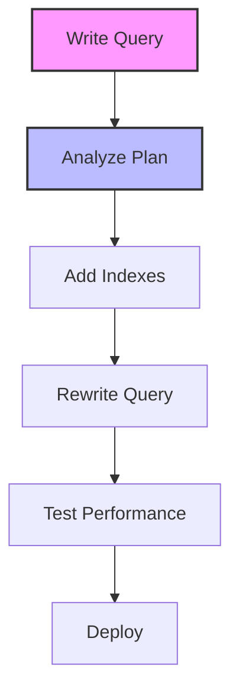

# SQL Optimization: Making Your Queries Lightning Fast

## Introduction: Why SQL Optimization Matters
Imagine a race car—no matter how powerful the engine, it needs tuning and the right fuel to win. SQL optimization is like tuning your database engine: it ensures your queries run as fast and efficiently as possible, saving time, resources, and money. Mastering optimization is essential for building scalable, high-performance applications.

---

## What is SQL Optimization?
**SQL optimization** is the process of improving the performance of SQL queries and database operations. It helps:
- Reduce query execution time
- Minimize resource usage (CPU, memory, I/O)
- Scale to large data volumes
- Prevent bottlenecks
- Improve user experience
- Lower infrastructure costs

---

## Key Concepts in SQL Optimization (with Examples)

### 1. Indexing
```sql
-- Create indexes on frequently queried columns
CREATE INDEX idx_customer_email ON customers(email);

-- Use composite indexes for multi-column searches
CREATE INDEX idx_order_customer_date ON orders(customer_id, order_date);
```

### 2. Query Rewriting
```sql
-- Avoid SELECT *
SELECT first_name, last_name FROM employees WHERE department = 'IT';

-- Use EXISTS instead of IN for subqueries
SELECT name FROM customers c WHERE EXISTS (
    SELECT 1 FROM orders o WHERE o.customer_id = c.customer_id
);
```

### 3. Analyzing Execution Plans
```sql
-- View the query plan (syntax varies by DBMS)
EXPLAIN SELECT * FROM orders WHERE customer_id = 1001;
```

### 4. Limiting Result Sets
```sql
-- Use LIMIT/OFFSET for pagination
SELECT * FROM products ORDER BY price DESC LIMIT 10 OFFSET 20;
```

### 5. Avoiding N+1 Query Problems
```sql
-- Use JOINs instead of multiple queries
SELECT o.order_id, c.name FROM orders o JOIN customers c ON o.customer_id = c.customer_id;
```

### 6. Using Proper Data Types
```sql
-- Use the most efficient type for your data
CREATE TABLE logs (
    log_id INT PRIMARY KEY,
    event_time TIMESTAMP,
    message TEXT
);
```

### 7. Partitioning Large Tables
```sql
-- Partition by range (PostgreSQL example)
CREATE TABLE sales_2024 PARTITION OF sales FOR VALUES FROM ('2024-01-01') TO ('2024-12-31');
```

---

## Visualizing the Optimization Process


---

## Real-World Examples

### Example 1: E-commerce Search Optimization
```sql
-- Optimize product search with indexes and query rewrite
CREATE INDEX idx_product_category_price ON products(category, price);
SELECT product_name, price FROM products WHERE category = 'Electronics' AND price < 500 ORDER BY price DESC LIMIT 20;
```

### Example 2: Reporting on Large Datasets
```sql
-- Use partitioning and summary tables
CREATE TABLE sales_summary AS
SELECT product_id, SUM(amount) as total_sales
FROM sales
GROUP BY product_id;

-- Query the summary table for reports
SELECT * FROM sales_summary WHERE total_sales > 10000;
```

---

## Best Practices & Key Takeaways
- Always analyze query plans
- Use indexes wisely (not too many, not too few)
- Avoid SELECT * in production queries
- Write set-based queries instead of row-by-row
- Test performance with realistic data
- Document optimization decisions

---

## Common Pitfalls to Avoid
- Over-indexing tables
- Ignoring query plans
- Using inefficient joins or subqueries
- Not archiving or partitioning old data
- Failing to monitor performance over time

---

## Further Exploration
- "SQL Performance Explained" by Markus Winand
- "High Performance MySQL" by Baron Schwartz
- Practice on Mode Analytics or SQLZoo

---
*This guide is designed to make SQL optimization clear and practical for everyone. For hands-on practice, refer to the exercises and projects in the course materials.* 