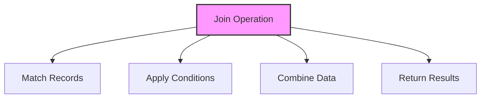

# SQL JOINs

## 🎯 Learning Outcomes
By the end of this overview, you will understand:
- Different types of SQL JOINs
- JOIN syntax and usage
- Join conditions
- Performance considerations
- Best practices for joining tables

## 📚 Introduction
SQL JOINs:
- Combine data from tables
- Support relationships
- Enable complex queries
- Essential for data analysis
- Maintain data integrity

## 🔄 Join Process


## 📊 Types of JOINs

### 1. INNER JOIN
- Returns matching records
- Most common join type
- Excludes non-matching rows

#### Syntax
```sql
SELECT columns
FROM table1
INNER JOIN table2
ON table1.column = table2.column;
```

#### Example
```sql
SELECT Orders.OrderID, Customers.CustomerName
FROM Orders
INNER JOIN Customers
ON Orders.CustomerID = Customers.CustomerID;
```

### 2. LEFT JOIN
- Returns all left table records
- Includes matching right records
- NULL for non-matching right records

#### Syntax
```sql
SELECT columns
FROM table1
LEFT JOIN table2
ON table1.column = table2.column;
```

#### Example
```sql
SELECT Customers.CustomerName, Orders.OrderID
FROM Customers
LEFT JOIN Orders
ON Customers.CustomerID = Orders.CustomerID;
```

### 3. RIGHT JOIN
- Returns all right table records
- Includes matching left records
- NULL for non-matching left records

#### Syntax
```sql
SELECT columns
FROM table1
RIGHT JOIN table2
ON table1.column = table2.column;
```

#### Example
```sql
SELECT Customers.CustomerName, Orders.OrderID
FROM Customers
RIGHT JOIN Orders
ON Customers.CustomerID = Orders.CustomerID;
```

### 4. FULL JOIN
- Returns all records from both tables
- NULL for non-matching records
- Combines LEFT and RIGHT JOIN

#### Syntax
```sql
SELECT columns
FROM table1
FULL JOIN table2
ON table1.column = table2.column;
```

#### Example
```sql
SELECT Customers.CustomerName, Orders.OrderID
FROM Customers
FULL JOIN Orders
ON Customers.CustomerID = Orders.CustomerID;
```

### 5. CROSS JOIN
- Returns Cartesian product
- All possible combinations
- No join condition needed

#### Syntax
```sql
SELECT columns
FROM table1
CROSS JOIN table2;
```

#### Example
```sql
SELECT Products.ProductName, Categories.CategoryName
FROM Products
CROSS JOIN Categories;
```

## 🔧 Join Conditions

### 1. Basic Equality
```sql
ON table1.column = table2.column
```

### 2. Multiple Conditions
```sql
ON table1.column1 = table2.column1
AND table1.column2 = table2.column2
```

### 3. Complex Conditions
```sql
ON table1.column1 = table2.column1
OR (table1.column2 = table2.column2
AND table1.column3 = table2.column3)
```

## 🎯 Performance Considerations

### 1. Index Usage
- Use indexed columns
- Consider composite indexes
- Monitor index usage

### 2. Join Order
- Start with smallest table
- Consider data distribution
- Use appropriate join type

### 3. Join Conditions
- Use simple conditions
- Avoid functions
- Consider NULL handling

## 🎓 Best Practices
1. Use appropriate join type
2. Consider performance
3. Handle NULL values
4. Use clear conditions
5. Document queries
6. Test thoroughly
7. Monitor execution
8. Optimize queries

## ⚠️ Common Errors
- Syntax errors
- Performance issues
- NULL handling
- Index usage
- Data type mismatch
- Logical errors
- Resource limits

## 📝 Quick Summary
- JOIN types
- Syntax patterns
- Performance tips
- Best practices
- Error prevention
- Use cases
- Optimization

## 🔍 Important Considerations
1. Query performance
2. Data accuracy
3. Index usage
4. NULL handling
5. Join logic
6. Documentation
7. Testing

## 💡 Tips
- Use appropriate joins
- Consider performance
- Handle NULL properly
- Use clear conditions
- Test thoroughly
- Document process
- Monitor execution

---
*This overview provides a comprehensive understanding of SQL JOINs. For practical implementation and examples, refer to the hands-on sections of the course.* 