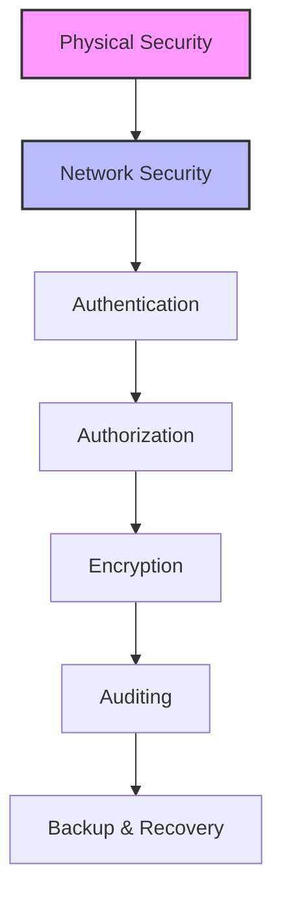

# SQL Security: Protecting Your Data Fortress

## Introduction: Why SQL Security Matters
Imagine your database as a vault full of treasures—customer data, financial records, business secrets. Without strong security, anyone could walk in and take what they want. SQL security is about building walls, setting guards, and using smart locks to keep your data safe from threats, both inside and out.

---

## What is SQL Security?
**SQL security** is the practice of protecting your database from unauthorized access, misuse, and attacks. It helps:
- Prevent data breaches
- Control user access
- Ensure data privacy
- Comply with regulations (GDPR, HIPAA, etc.)
- Detect and respond to threats
- Maintain trust and business reputation

---

## Key Concepts in SQL Security (with Examples)

### 1. Authentication and Authorization
```sql
-- Create users and roles
CREATE USER analyst IDENTIFIED BY 'StrongPassword!';
CREATE ROLE reporting_role;
GRANT reporting_role TO analyst;

-- Grant permissions
GRANT SELECT, INSERT ON sales TO reporting_role;
REVOKE DELETE ON sales FROM reporting_role;
```

### 2. Principle of Least Privilege
- Only give users the minimum permissions they need.
- Regularly review and update permissions.

### 3. Encryption
```sql
-- Encrypt data at rest (syntax varies by DBMS)
CREATE TABLE customers (
    customer_id INT PRIMARY KEY,
    name VARCHAR(100),
    ssn VARBINARY(256) ENCRYPTED
);

-- Encrypt data in transit (enable SSL/TLS in DBMS settings)
```

### 4. SQL Injection Prevention
```sql
-- Use parameterized queries
PREPARE stmt FROM 'SELECT * FROM users WHERE username = ? AND password = ?';
EXECUTE stmt USING @username, @password;

-- Avoid dynamic SQL with user input
```

### 5. Auditing and Monitoring
```sql
-- Enable audit logs (syntax varies by DBMS)
ALTER SERVER AUDIT audit_log ADD (DATABASE_OBJECT_ACCESS_GROUP);
-- Regularly review logs for suspicious activity
```

### 6. Backup and Recovery
```sql
-- Regularly back up your database
BACKUP DATABASE mydb TO DISK = '/backups/mydb.bak';
-- Test restores to ensure backups work
```

---

## Visualizing Security Layers


---

## Real-World Examples

### Example 1: Preventing Data Breaches
- Use strong passwords and multi-factor authentication.
- Restrict access to sensitive tables (e.g., payroll, customer data).
- Monitor failed login attempts and lock out suspicious users.

### Example 2: Defending Against SQL Injection
- Always use parameterized queries or prepared statements.
- Validate and sanitize all user input.
- Never expose database error messages to end users.

### Example 3: Regulatory Compliance
- Mask or encrypt personally identifiable information (PII).
- Implement audit trails for sensitive operations.
- Regularly review and update security policies.

---

## Best Practices & Key Takeaways
- Enforce strong authentication and access controls
- Use encryption for sensitive data
- Regularly audit and monitor database activity
- Backup data and test recovery plans
- Educate users and developers about security risks
- Stay updated on security patches and best practices

---

## Common Pitfalls to Avoid
- Using default or weak passwords
- Granting excessive privileges
- Ignoring SQL injection risks
- Failing to encrypt sensitive data
- Not monitoring or auditing activity
- Neglecting regular backups

---

## Further Exploration
- "SQL Server Security" by Denny Cherry
- "Database Security: What Students Need to Know" by David Litchfield
- Practice on Mode Analytics or SQLZoo

---
*This guide is designed to make SQL security clear and practical for everyone. For hands-on practice, refer to the exercises and projects in the course materials.* 