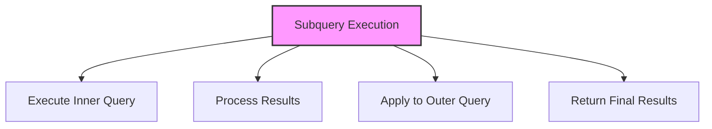

# SQL Subqueries

## 🎯 Learning Outcomes
By the end of this overview, you will understand:
- Types of SQL Subqueries
- Subquery syntax and usage
- Subquery placement
- Performance considerations
- Best practices for nested queries

## 📚 Introduction
SQL Subqueries:
- Nested queries
- Support complex logic
- Enable data comparison
- Essential for analysis
- Maintain data integrity

## 🔄 Subquery Process


## 📊 Types of Subqueries

### 1. Scalar Subquery
- Returns single value
- Used in WHERE clause
- Used in SELECT clause

#### Syntax
```sql
SELECT column1, (SELECT MAX(column2) FROM table2)
FROM table1;
```

#### Example
```sql
SELECT ProductName, 
       (SELECT MAX(Price) FROM Products) as MaxPrice
FROM Products;
```

### 2. Column Subquery
- Returns single column
- Used in WHERE clause
- Used with IN operator

#### Syntax
```sql
SELECT column1
FROM table1
WHERE column1 IN (SELECT column2 FROM table2);
```

#### Example
```sql
SELECT CustomerName
FROM Customers
WHERE CustomerID IN (SELECT CustomerID FROM Orders);
```

### 3. Row Subquery
- Returns multiple columns
- Used in WHERE clause
- Used with comparison operators

#### Syntax
```sql
SELECT column1
FROM table1
WHERE (column1, column2) IN 
      (SELECT column1, column2 FROM table2);
```

#### Example
```sql
SELECT ProductName
FROM Products
WHERE (Category, Price) IN 
      (SELECT Category, MAX(Price) 
       FROM Products 
       GROUP BY Category);
```

### 4. Table Subquery
- Returns multiple rows
- Used in FROM clause
- Used as derived table

#### Syntax
```sql
SELECT *
FROM (SELECT column1, column2 FROM table1) as alias;
```

#### Example
```sql
SELECT *
FROM (SELECT Category, AVG(Price) as AvgPrice 
      FROM Products 
      GROUP BY Category) as CategoryStats;
```

## 🔧 Subquery Placement

### 1. WHERE Clause
```sql
SELECT column1
FROM table1
WHERE column1 > (SELECT AVG(column1) FROM table1);
```

### 2. FROM Clause
```sql
SELECT *
FROM (SELECT column1, COUNT(*) as count 
      FROM table1 
      GROUP BY column1) as stats;
```

### 3. SELECT Clause
```sql
SELECT column1,
       (SELECT COUNT(*) FROM table2 
        WHERE table2.column1 = table1.column1) as count
FROM table1;
```

### 4. HAVING Clause
```sql
SELECT column1, COUNT(*)
FROM table1
GROUP BY column1
HAVING COUNT(*) > (SELECT AVG(count) 
                   FROM (SELECT COUNT(*) as count 
                         FROM table1 
                         GROUP BY column1) as stats);
```

## 🎯 Performance Considerations

### 1. Index Usage
- Use indexed columns
- Consider subquery optimization
- Monitor execution plan

### 2. Subquery Type
- Choose appropriate type
- Consider alternatives
- Evaluate performance

### 3. Data Volume
- Consider result set size
- Use appropriate limits
- Monitor resource usage

## 🎓 Best Practices
1. Use appropriate subquery type
2. Consider performance
3. Handle NULL values
4. Use clear logic
5. Document queries
6. Test thoroughly
7. Monitor execution
8. Optimize queries

## ⚠️ Common Errors
- Syntax errors
- Performance issues
- NULL handling
- Index usage
- Data type mismatch
- Logical errors
- Resource limits

## 📝 Quick Summary
- Subquery types
- Syntax patterns
- Performance tips
- Best practices
- Error prevention
- Use cases
- Optimization

## 🔍 Important Considerations
1. Query performance
2. Data accuracy
3. Index usage
4. NULL handling
5. Subquery logic
6. Documentation
7. Testing

## 💡 Tips
- Use appropriate subqueries
- Consider performance
- Handle NULL properly
- Use clear logic
- Test thoroughly
- Document process
- Monitor execution

---
*This overview provides a comprehensive understanding of SQL Subqueries. For practical implementation and examples, refer to the hands-on sections of the course.* 