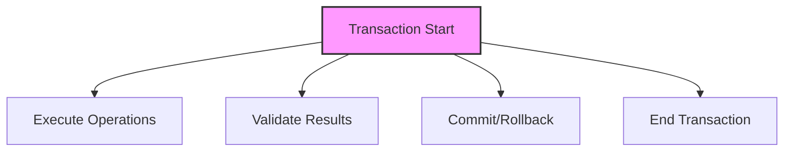

# SQL Transactions

## 🎯 Learning Outcomes
By the end of this overview, you will understand:
- Transaction concepts
- ACID properties
- Transaction management
- Isolation levels
- Best practices for transactions

## 📚 Introduction
SQL Transactions:
- Data consistency
- Atomic operations
- Error handling
- Concurrency control
- Data integrity

## 🔄 Transaction Process


## 📊 ACID Properties

### 1. Atomicity
- All or nothing
- Complete success
- Complete failure
- No partial updates

### 2. Consistency
- Valid state
- Data integrity
- Constraint satisfaction
- Business rules

### 3. Isolation
- Concurrent execution
- Independent transactions
- No interference
- Data consistency

### 4. Durability
- Permanent changes
- System recovery
- Data persistence
- Crash protection

## 🔧 Transaction Management

### 1. Basic Transaction
```sql
BEGIN TRANSACTION;
    -- SQL statements
COMMIT;
```

### 2. Error Handling
```sql
BEGIN TRANSACTION;
    -- SQL statements
    IF @@ERROR <> 0
    BEGIN
        ROLLBACK;
        RETURN;
    END
COMMIT;
```

### 3. Savepoints
```sql
BEGIN TRANSACTION;
    -- SQL statements
    SAVE TRANSACTION savepoint_name;
    -- More SQL statements
    ROLLBACK TRANSACTION savepoint_name;
COMMIT;
```

## 🎯 Isolation Levels

### 1. Read Uncommitted
- Lowest isolation
- Dirty reads
- No locks
- Best performance

### 2. Read Committed
- Default level
- No dirty reads
- Row locks
- Good balance

### 3. Repeatable Read
- Consistent reads
- Range locks
- No phantom reads
- Higher isolation

### 4. Serializable
- Highest isolation
- Table locks
- No concurrency
- Worst performance

## 🎓 Best Practices
1. Keep transactions short
2. Handle errors properly
3. Use appropriate isolation
4. Avoid long transactions
5. Document transactions
6. Test thoroughly
7. Monitor performance
8. Optimize queries

## ⚠️ Common Errors
- Deadlocks
- Timeouts
- Lock contention
- Performance issues
- Data inconsistency
- Resource limits
- Connection issues

## 📝 Quick Summary
- ACID properties
- Transaction management
- Isolation levels
- Performance tips
- Best practices
- Error prevention
- Optimization

## 🔍 Important Considerations
1. Data consistency
2. Performance impact
3. Error handling
4. Concurrency
5. Resource usage
6. Documentation
7. Testing

## 💡 Tips
- Use appropriate isolation
- Handle errors properly
- Keep transactions short
- Monitor performance
- Test thoroughly
- Document process
- Monitor resources

---
*This overview provides a comprehensive understanding of SQL Transactions. For practical implementation and examples, refer to the hands-on sections of the course.* 