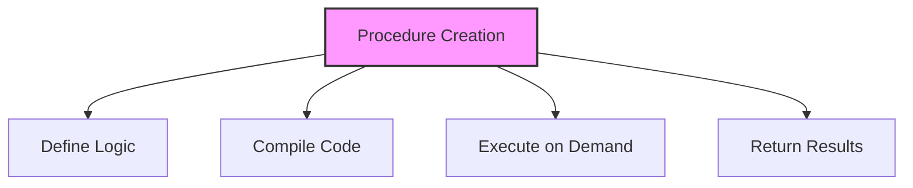

# SQL Stored Procedures

## 🎯 Learning Outcomes
By the end of this overview, you will understand:
- Stored procedure concepts
- Creation and usage
- Parameters and variables
- Error handling
- Best practices for procedures

## 📚 Introduction
Stored Procedures:
- Reusable code
- Performance optimization
- Security enhancement
- Business logic
- Data integrity

## 🔄 Procedure Process


## 📊 Basic Structure

### 1. Simple Procedure
```sql
CREATE PROCEDURE procedure_name
AS
BEGIN
    -- SQL statements
END;
```

### 2. With Parameters
```sql
CREATE PROCEDURE procedure_name
    @param1 datatype,
    @param2 datatype
AS
BEGIN
    -- SQL statements
END;
```

### 3. With Return Value
```sql
CREATE PROCEDURE procedure_name
    @param1 datatype,
    @param2 datatype OUTPUT
AS
BEGIN
    -- SQL statements
    SET @param2 = value;
END;
```

## 🔧 Common Operations

### 1. Creating Procedures
```sql
CREATE PROCEDURE GetCustomerOrders
    @CustomerID int
AS
BEGIN
    SELECT * FROM Orders
    WHERE CustomerID = @CustomerID;
END;
```

### 2. Executing Procedures
```sql
EXEC GetCustomerOrders @CustomerID = 1;
```

### 3. Modifying Procedures
```sql
ALTER PROCEDURE GetCustomerOrders
    @CustomerID int,
    @OrderDate date
AS
BEGIN
    SELECT * FROM Orders
    WHERE CustomerID = @CustomerID
    AND OrderDate = @OrderDate;
END;
```

### 4. Dropping Procedures
```sql
DROP PROCEDURE GetCustomerOrders;
```

## 🎯 Error Handling

### 1. Try-Catch Block
```sql
CREATE PROCEDURE procedure_name
AS
BEGIN
    BEGIN TRY
        -- SQL statements
    END TRY
    BEGIN CATCH
        -- Error handling
    END CATCH
END;
```

### 2. Error Information
```sql
SELECT 
    ERROR_NUMBER() AS ErrorNumber,
    ERROR_MESSAGE() AS ErrorMessage,
    ERROR_SEVERITY() AS ErrorSeverity,
    ERROR_STATE() AS ErrorState;
```

## 🎓 Best Practices
1. Use clear naming
2. Document procedures
3. Handle errors
4. Use parameters
5. Optimize performance
6. Test thoroughly
7. Monitor usage
8. Maintain code

## ⚠️ Common Errors
- Syntax errors
- Parameter issues
- Performance problems
- Error handling
- Security issues
- Resource limits
- Maintenance

## 📝 Quick Summary
- Procedure creation
- Parameter handling
- Error management
- Performance tips
- Best practices
- Error prevention
- Optimization

## 🔍 Important Considerations
1. Code organization
2. Performance impact
3. Error handling
4. Security
5. Maintenance
6. Documentation
7. Testing

## 💡 Tips
- Use clear naming
- Handle errors properly
- Document procedures
- Test thoroughly
- Monitor performance
- Maintain code
- Use parameters

---
*This overview provides a comprehensive understanding of SQL Stored Procedures. For practical implementation and examples, refer to the hands-on sections of the course.* 