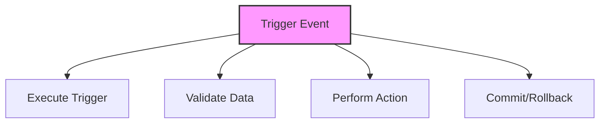

# SQL Triggers

## 🎯 Learning Outcomes
By the end of this overview, you will understand:
- Types of SQL Triggers
- Trigger creation and usage
- Trigger events
- Error handling
- Best practices for triggers

## 📚 Introduction
SQL Triggers:
- Automatic execution
- Event-driven
- Data integrity
- Business rules
- Audit trails

## 🔄 Trigger Process


## 📊 Types of Triggers

### 1. DML Triggers
- INSERT operations
- UPDATE operations
- DELETE operations
- AFTER/FOR triggers
- INSTEAD OF triggers

#### Syntax
```sql
CREATE TRIGGER trigger_name
ON table_name
AFTER INSERT, UPDATE, DELETE
AS
BEGIN
    -- Trigger logic
END;
```

#### Example
```sql
CREATE TRIGGER trg_CustomerAudit
ON Customers
AFTER INSERT, UPDATE, DELETE
AS
BEGIN
    INSERT INTO CustomerAudit (Action, CustomerID, ActionDate)
    SELECT 
        CASE 
            WHEN EXISTS (SELECT 1 FROM inserted) AND 
                 EXISTS (SELECT 1 FROM deleted) THEN 'UPDATE'
            WHEN EXISTS (SELECT 1 FROM inserted) THEN 'INSERT'
            ELSE 'DELETE'
        END,
        COALESCE(i.CustomerID, d.CustomerID),
        GETDATE()
    FROM inserted i
    FULL OUTER JOIN deleted d ON i.CustomerID = d.CustomerID;
END;
```

### 2. DDL Triggers
- CREATE operations
- ALTER operations
- DROP operations
- Database-level
- Server-level

#### Syntax
```sql
CREATE TRIGGER trigger_name
ON DATABASE
FOR CREATE_TABLE, ALTER_TABLE, DROP_TABLE
AS
BEGIN
    -- Trigger logic
END;
```

#### Example
```sql
CREATE TRIGGER trg_DatabaseAudit
ON DATABASE
FOR CREATE_TABLE, ALTER_TABLE, DROP_TABLE
AS
BEGIN
    INSERT INTO DatabaseAudit (EventType, ObjectName, EventDate)
    SELECT 
        EVENTDATA().value('(/EVENT_INSTANCE/EventType)[1]', 'varchar(50)'),
        EVENTDATA().value('(/EVENT_INSTANCE/ObjectName)[1]', 'varchar(50)'),
        GETDATE();
END;
```

## 🔧 Trigger Operations

### 1. Creating Triggers
```sql
CREATE TRIGGER trigger_name
ON table_name
AFTER event_type
AS
BEGIN
    -- Trigger logic
END;
```

### 2. Modifying Triggers
```sql
ALTER TRIGGER trigger_name
ON table_name
AFTER event_type
AS
BEGIN
    -- Updated trigger logic
END;
```

### 3. Disabling Triggers
```sql
DISABLE TRIGGER trigger_name
ON table_name;
```

### 4. Enabling Triggers
```sql
ENABLE TRIGGER trigger_name
ON table_name;
```

### 5. Dropping Triggers
```sql
DROP TRIGGER trigger_name
ON table_name;
```

## 🎯 Common Use Cases

### 1. Audit Trails
```sql
CREATE TRIGGER trg_AuditTrail
ON TableName
AFTER INSERT, UPDATE, DELETE
AS
BEGIN
    INSERT INTO AuditLog (TableName, Action, RecordID, ChangeDate)
    SELECT 
        'TableName',
        CASE 
            WHEN EXISTS (SELECT 1 FROM inserted) AND 
                 EXISTS (SELECT 1 FROM deleted) THEN 'UPDATE'
            WHEN EXISTS (SELECT 1 FROM inserted) THEN 'INSERT'
            ELSE 'DELETE'
        END,
        COALESCE(i.ID, d.ID),
        GETDATE()
    FROM inserted i
    FULL OUTER JOIN deleted d ON i.ID = d.ID;
END;
```

### 2. Data Validation
```sql
CREATE TRIGGER trg_ValidateData
ON TableName
AFTER INSERT, UPDATE
AS
BEGIN
    IF EXISTS (SELECT 1 FROM inserted WHERE ColumnName < 0)
    BEGIN
        RAISERROR('Invalid value', 16, 1);
        ROLLBACK TRANSACTION;
    END;
END;
```

## 🎓 Best Practices
1. Keep triggers simple
2. Handle errors properly
3. Avoid long-running operations
4. Document triggers
5. Test thoroughly
6. Monitor performance
7. Maintain code
8. Use appropriate events

## ⚠️ Common Errors
- Infinite loops
- Performance issues
- Error handling
- Transaction management
- Resource limits
- Maintenance
- Testing

## 📝 Quick Summary
- Trigger types
- Creation syntax
- Common use cases
- Performance tips
- Best practices
- Error prevention
- Optimization

## 🔍 Important Considerations
1. Performance impact
2. Error handling
3. Transaction management
4. Resource usage
5. Maintenance
6. Documentation
7. Testing

## 💡 Tips
- Keep triggers simple
- Handle errors properly
- Document triggers
- Test thoroughly
- Monitor performance
- Maintain code
- Use appropriate events

---
*This overview provides a comprehensive understanding of SQL Triggers. For practical implementation and examples, refer to the hands-on sections of the course.* 