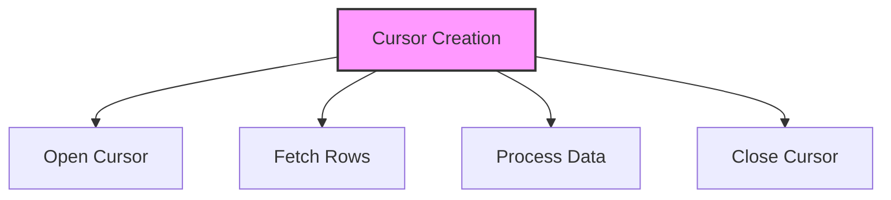

# SQL Cursors

## 🎯 Learning Outcomes
By the end of this overview, you will understand:
- Types of SQL Cursors
- Cursor creation and usage
- Cursor operations
- Performance considerations
- Best practices for cursors

## 📚 Introduction
SQL Cursors:
- Row-by-row processing
- Result set navigation
- Data manipulation
- Complex operations
- Performance impact

## 🔄 Cursor Process


## 📊 Types of Cursors

### 1. Static Cursor
- Snapshot of data
- No updates
- Memory resident
- Fast performance

#### Syntax
```sql
DECLARE cursor_name CURSOR
STATIC FOR
SELECT column1, column2
FROM table_name
WHERE condition;
```

#### Example
```sql
DECLARE CustomerCursor CURSOR
STATIC FOR
SELECT CustomerID, CustomerName
FROM Customers
WHERE Status = 'Active';
```

### 2. Dynamic Cursor
- Real-time data
- Updates visible
- Resource intensive
- Slower performance

#### Syntax
```sql
DECLARE cursor_name CURSOR
DYNAMIC FOR
SELECT column1, column2
FROM table_name
WHERE condition;
```

#### Example
```sql
DECLARE OrderCursor CURSOR
DYNAMIC FOR
SELECT OrderID, OrderDate
FROM Orders
WHERE Status = 'Pending';
```

### 3. Forward-Only Cursor
- One direction
- No scrolling
- Better performance
- Limited functionality

#### Syntax
```sql
DECLARE cursor_name CURSOR
FORWARD_ONLY FOR
SELECT column1, column2
FROM table_name
WHERE condition;
```

#### Example
```sql
DECLARE ProductCursor CURSOR
FORWARD_ONLY FOR
SELECT ProductID, Price
FROM Products
WHERE Stock > 0;
```

## 🔧 Cursor Operations

### 1. Basic Cursor
```sql
DECLARE @CustomerID int, @CustomerName varchar(100);

DECLARE CustomerCursor CURSOR FOR
SELECT CustomerID, CustomerName
FROM Customers;

OPEN CustomerCursor;
FETCH NEXT FROM CustomerCursor INTO @CustomerID, @CustomerName;

WHILE @@FETCH_STATUS = 0
BEGIN
    -- Process row
    FETCH NEXT FROM CustomerCursor INTO @CustomerID, @CustomerName;
END;

CLOSE CustomerCursor;
DEALLOCATE CustomerCursor;
```

### 2. Error Handling
```sql
BEGIN TRY
    DECLARE cursor_name CURSOR FOR
    SELECT column1, column2
    FROM table_name;

    OPEN cursor_name;
    -- Cursor operations
    CLOSE cursor_name;
    DEALLOCATE cursor_name;
END TRY
BEGIN CATCH
    IF CURSOR_STATUS('global', 'cursor_name') >= 0
    BEGIN
        CLOSE cursor_name;
        DEALLOCATE cursor_name;
    END;
    -- Error handling
END CATCH;
```

## 🎯 Common Use Cases

### 1. Data Processing
```sql
DECLARE @ID int, @Name varchar(100);

DECLARE ProcessCursor CURSOR FOR
SELECT ID, Name FROM TableName;

OPEN ProcessCursor;
FETCH NEXT FROM ProcessCursor INTO @ID, @Name;

WHILE @@FETCH_STATUS = 0
BEGIN
    -- Process each row
    UPDATE TableName
    SET Processed = 1
    WHERE ID = @ID;
    
    FETCH NEXT FROM ProcessCursor INTO @ID, @Name;
END;

CLOSE ProcessCursor;
DEALLOCATE ProcessCursor;
```

### 2. Complex Calculations
```sql
DECLARE @Value decimal, @Total decimal = 0;

DECLARE CalcCursor CURSOR FOR
SELECT Value FROM TableName;

OPEN CalcCursor;
FETCH NEXT FROM CalcCursor INTO @Value;

WHILE @@FETCH_STATUS = 0
BEGIN
    SET @Total = @Total + @Value;
    FETCH NEXT FROM CalcCursor INTO @Value;
END;

CLOSE CalcCursor;
DEALLOCATE CalcCursor;
```

## 🎓 Best Practices
1. Use appropriate cursor type
2. Handle errors properly
3. Close cursors
4. Deallocate resources
5. Document operations
6. Test thoroughly
7. Monitor performance
8. Consider alternatives

## ⚠️ Common Errors
- Resource leaks
- Performance issues
- Error handling
- Memory usage
- Lock contention
- Maintenance
- Testing

## 📝 Quick Summary
- Cursor types
- Basic operations
- Error handling
- Performance tips
- Best practices
- Error prevention
- Optimization

## 🔍 Important Considerations
1. Performance impact
2. Resource usage
3. Error handling
4. Memory management
5. Maintenance
6. Documentation
7. Testing

## 💡 Tips
- Use appropriate cursor type
- Handle errors properly
- Close and deallocate
- Document operations
- Test thoroughly
- Monitor performance
- Consider alternatives

---
*This overview provides a comprehensive understanding of SQL Cursors. For practical implementation and examples, refer to the hands-on sections of the course.* 