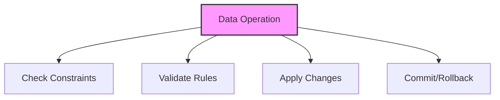

# SQL Constraints

## 🎯 Learning Outcomes
By the end of this overview, you will understand:
- Types of SQL Constraints
- Constraint creation and usage
- Data integrity
- Performance considerations
- Best practices for constraints

## 📚 Introduction
SQL Constraints:
- Data validation
- Referential integrity
- Business rules
- Data consistency
- Error prevention

## 🔄 Constraint Process


## 📊 Types of Constraints

### 1. Primary Key
- Unique identifier
- Not null
- Single or composite
- Table uniqueness

#### Syntax
```sql
CREATE TABLE table_name (
    column1 datatype PRIMARY KEY,
    column2 datatype
);
```

#### Example
```sql
CREATE TABLE Customers (
    CustomerID int PRIMARY KEY,
    CustomerName varchar(100)
);
```

### 2. Foreign Key
- Referential integrity
- Parent-child relationship
- Cascade options
- Data consistency

#### Syntax
```sql
CREATE TABLE table_name (
    column1 datatype,
    column2 datatype,
    FOREIGN KEY (column1) 
    REFERENCES parent_table(column)
);
```

#### Example
```sql
CREATE TABLE Orders (
    OrderID int PRIMARY KEY,
    CustomerID int,
    FOREIGN KEY (CustomerID) 
    REFERENCES Customers(CustomerID)
);
```

### 3. Unique
- Column uniqueness
- Null values allowed
- Multiple columns
- Data integrity

#### Syntax
```sql
CREATE TABLE table_name (
    column1 datatype,
    column2 datatype,
    UNIQUE (column1, column2)
);
```

#### Example
```sql
CREATE TABLE Products (
    ProductID int PRIMARY KEY,
    ProductCode varchar(20) UNIQUE
);
```

### 4. Check
- Value validation
- Business rules
- Data range
- Custom conditions

#### Syntax
```sql
CREATE TABLE table_name (
    column1 datatype,
    column2 datatype,
    CHECK (condition)
);
```

#### Example
```sql
CREATE TABLE Employees (
    EmployeeID int PRIMARY KEY,
    Salary decimal(10,2),
    CHECK (Salary > 0)
);
```

### 5. Not Null
- Required values
- Data completeness
- Default values
- Data validation

#### Syntax
```sql
CREATE TABLE table_name (
    column1 datatype NOT NULL,
    column2 datatype
);
```

#### Example
```sql
CREATE TABLE Users (
    UserID int PRIMARY KEY,
    Username varchar(50) NOT NULL
);
```

## 🔧 Constraint Operations

### 1. Adding Constraints
```sql
ALTER TABLE table_name
ADD CONSTRAINT constraint_name
constraint_type (column);
```

### 2. Dropping Constraints
```sql
ALTER TABLE table_name
DROP CONSTRAINT constraint_name;
```

### 3. Disabling Constraints
```sql
ALTER TABLE table_name
NOCHECK CONSTRAINT constraint_name;
```

### 4. Enabling Constraints
```sql
ALTER TABLE table_name
CHECK CONSTRAINT constraint_name;
```

## 🎯 Common Use Cases

### 1. Data Validation
```sql
CREATE TABLE Products (
    ProductID int PRIMARY KEY,
    ProductName varchar(100) NOT NULL,
    Price decimal(10,2) CHECK (Price > 0),
    CategoryID int FOREIGN KEY 
    REFERENCES Categories(CategoryID)
);
```

### 2. Referential Integrity
```sql
CREATE TABLE Orders (
    OrderID int PRIMARY KEY,
    CustomerID int FOREIGN KEY 
    REFERENCES Customers(CustomerID)
    ON DELETE CASCADE,
    OrderDate date NOT NULL,
    Status varchar(20) CHECK 
    (Status IN ('Pending', 'Completed', 'Cancelled'))
);
```

## 🎓 Best Practices
1. Use appropriate constraints
2. Consider performance
3. Handle errors
4. Document constraints
5. Test thoroughly
6. Monitor impact
7. Maintain integrity
8. Plan for changes

## ⚠️ Common Errors
- Constraint violations
- Performance issues
- Data inconsistency
- Maintenance
- Testing
- Documentation
- Changes

## 📝 Quick Summary
- Constraint types
- Creation syntax
- Common use cases
- Performance tips
- Best practices
- Error prevention
- Optimization

## 🔍 Important Considerations
1. Data integrity
2. Performance impact
3. Error handling
4. Maintenance
5. Documentation
6. Testing
7. Changes

## 💡 Tips
- Use appropriate constraints
- Consider performance
- Handle errors properly
- Document constraints
- Test thoroughly
- Monitor impact
- Plan for changes

---
*This overview provides a comprehensive understanding of SQL Constraints. For practical implementation and examples, refer to the hands-on sections of the course.* 