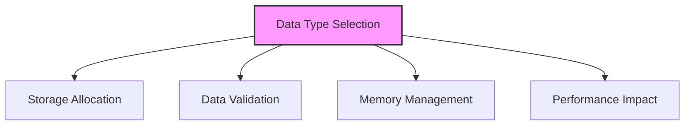

# SQL Data Types

## 🎯 Learning Outcomes
By the end of this overview, you will understand:
- Types of SQL Data Types
- Data type selection
- Storage requirements
- Performance considerations
- Best practices for data types

## 📚 Introduction
SQL Data Types:
- Data storage
- Memory usage
- Performance impact
- Data validation
- Compatibility

## 🔄 Data Type Process


## 📊 Categories of Data Types

### 1. Numeric Types
- Integer types
- Decimal types
- Floating-point types
- Money types

#### Integer Types
```sql
-- Tinyint
TINYINT -- 1 byte, 0 to 255

-- Smallint
SMALLINT -- 2 bytes, -32,768 to 32,767

-- Int
INT -- 4 bytes, -2^31 to 2^31-1

-- Bigint
BIGINT -- 8 bytes, -2^63 to 2^63-1
```

#### Decimal Types
```sql
-- Decimal
DECIMAL(p,s) -- p digits, s decimal places

-- Numeric
NUMERIC(p,s) -- Same as DECIMAL

-- Money
MONEY -- 8 bytes, -2^63 to 2^63-1
```

### 2. Character Types
- Fixed-length
- Variable-length
- Unicode support
- Text storage

#### Fixed-Length
```sql
-- Char
CHAR(n) -- n characters, fixed length

-- Nchar
NCHAR(n) -- n Unicode characters
```

#### Variable-Length
```sql
-- Varchar
VARCHAR(n) -- n characters, variable length

-- Nvarchar
NVARCHAR(n) -- n Unicode characters

-- Text
TEXT -- Variable length, up to 2GB
```

### 3. Date and Time Types
- Date only
- Time only
- Combined
- Timestamp

#### Date Types
```sql
-- Date
DATE -- YYYY-MM-DD

-- Time
TIME -- HH:MM:SS

-- Datetime
DATETIME -- YYYY-MM-DD HH:MM:SS

-- Datetime2
DATETIME2 -- More precise
```

### 4. Binary Types
- Binary data
- Image storage
- File storage
- Large objects

#### Binary Types
```sql
-- Binary
BINARY(n) -- n bytes, fixed length

-- Varbinary
VARBINARY(n) -- n bytes, variable length

-- Image
IMAGE -- Variable length, up to 2GB
```

### 5. Other Types
- Boolean
- XML
- JSON
- Custom types

#### Other Types
```sql
-- Bit
BIT -- 0 or 1

-- XML
XML -- XML data

-- JSON
JSON -- JSON data
```

## 🔧 Data Type Selection

### 1. Size Considerations
- Storage requirements
- Memory usage
- Performance impact
- Network traffic

### 2. Precision Requirements
- Decimal places
- Date/time precision
- Character length
- Binary size

### 3. Performance Impact
- Index efficiency
- Query performance
- Storage optimization
- Memory usage

## 🎯 Common Use Cases

### 1. Numeric Data
```sql
CREATE TABLE Products (
    ProductID INT PRIMARY KEY,
    Price DECIMAL(10,2),
    Quantity SMALLINT,
    Weight FLOAT
);
```

### 2. Character Data
```sql
CREATE TABLE Customers (
    CustomerID INT PRIMARY KEY,
    FirstName VARCHAR(50),
    LastName VARCHAR(50),
    Email NVARCHAR(100)
);
```

### 3. Date/Time Data
```sql
CREATE TABLE Orders (
    OrderID INT PRIMARY KEY,
    OrderDate DATE,
    OrderTime TIME,
    CreatedAt DATETIME2
);
```

## 🎓 Best Practices
1. Choose appropriate types
2. Consider storage
3. Plan for growth
4. Document types
5. Test thoroughly
6. Monitor performance
7. Maintain consistency
8. Optimize usage

## ⚠️ Common Errors
- Type mismatch
- Storage issues
- Performance problems
- Data truncation
- Conversion errors
- Maintenance
- Testing

## 📝 Quick Summary
- Data type categories
- Selection criteria
- Common use cases
- Performance tips
- Best practices
- Error prevention
- Optimization

## 🔍 Important Considerations
1. Storage requirements
2. Performance impact
3. Data validation
4. Compatibility
5. Maintenance
6. Documentation
7. Testing

## 💡 Tips
- Choose appropriate types
- Consider storage
- Plan for growth
- Document types
- Test thoroughly
- Monitor performance
- Maintain consistency

---
*This overview provides a comprehensive understanding of SQL Data Types. For practical implementation and examples, refer to the hands-on sections of the course.* 