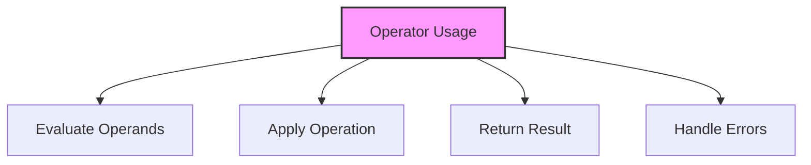

# SQL Operators

## 🎯 Learning Outcomes
By the end of this overview, you will understand:
- Types of SQL Operators
- Operator usage
- Operator precedence
- Performance considerations
- Best practices for operators

## 📚 Introduction
SQL Operators:
- Data manipulation
- Condition evaluation
- Value comparison
- Logical operations
- Mathematical calculations

## 🔄 Operator Process


## 📊 Types of Operators

### 1. Arithmetic Operators
- Basic calculations
- Numeric operations
- Result precision
- Error handling

#### Basic Operators
```sql
-- Addition
SELECT column1 + column2

-- Subtraction
SELECT column1 - column2

-- Multiplication
SELECT column1 * column2

-- Division
SELECT column1 / column2

-- Modulo
SELECT column1 % column2
```

### 2. Comparison Operators
- Value comparison
- Pattern matching
- Range checking
- NULL handling

#### Basic Comparisons
```sql
-- Equal to
column1 = column2

-- Not equal to
column1 != column2

-- Greater than
column1 > column2

-- Less than
column1 < column2

-- Greater than or equal
column1 >= column2

-- Less than or equal
column1 <= column2
```

### 3. Logical Operators
- Condition combination
- Boolean logic
- Truth tables
- Short-circuit evaluation

#### Basic Logic
```sql
-- AND
condition1 AND condition2

-- OR
condition1 OR condition2

-- NOT
NOT condition

-- Combined
(condition1 AND condition2) OR (condition3 AND condition4)
```

### 4. String Operators
- Concatenation
- Pattern matching
- String manipulation
- Case sensitivity

#### String Operations
```sql
-- Concatenation
column1 + column2

-- LIKE
column LIKE pattern

-- IN
column IN (value1, value2, ...)

-- BETWEEN
column BETWEEN value1 AND value2
```

## 🔧 Operator Precedence

### 1. Basic Rules
1. Parentheses
2. Multiplication/Division
3. Addition/Subtraction
4. Comparison
5. NOT
6. AND
7. OR

### 2. Examples
```sql
-- Complex expression
SELECT *
FROM table
WHERE (column1 > 10 AND column2 < 20)
   OR (column3 = 'value' AND column4 IS NOT NULL);
```

## 🎯 Common Use Cases

### 1. Data Filtering
```sql
SELECT *
FROM Products
WHERE Price > 100
  AND Category IN ('Electronics', 'Computers')
  AND Stock > 0;
```

### 2. Data Calculation
```sql
SELECT 
    ProductName,
    Price * Quantity as TotalValue,
    (Price * Quantity) * 0.1 as Tax
FROM OrderDetails;
```

### 3. Pattern Matching
```sql
SELECT *
FROM Customers
WHERE Email LIKE '%@gmail.com'
  AND Phone LIKE '555%';
```

## 🎓 Best Practices
1. Use parentheses
2. Consider precedence
3. Handle NULL values
4. Optimize conditions
5. Document logic
6. Test thoroughly
7. Monitor performance
8. Maintain readability

## ⚠️ Common Errors
- Precedence issues
- NULL handling
- Type conversion
- Performance problems
- Logical errors
- Syntax errors
- Maintenance

## 📝 Quick Summary
- Operator types
- Usage patterns
- Precedence rules
- Performance tips
- Best practices
- Error prevention
- Optimization

## 🔍 Important Considerations
1. Operator precedence
2. NULL handling
3. Type conversion
4. Performance
5. Readability
6. Documentation
7. Testing

## 💡 Tips
- Use parentheses
- Handle NULL properly
- Consider precedence
- Optimize conditions
- Document logic
- Test thoroughly
- Monitor performance

---
*This overview provides a comprehensive understanding of SQL Operators. For practical implementation and examples, refer to the hands-on sections of the course.* 