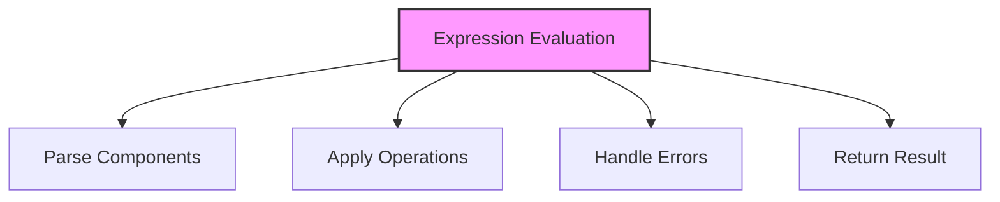

# SQL Expressions

## 🎯 Learning Outcomes
By the end of this overview, you will understand:
- Types of SQL Expressions
- Expression evaluation
- Expression components
- Performance considerations
- Best practices for expressions

## 📚 Introduction
SQL Expressions:
- Value calculation
- Condition evaluation
- Data transformation
- Result generation
- Query building

## 🔄 Expression Process


## 📊 Types of Expressions

### 1. Scalar Expressions
- Single value
- Calculations
- Functions
- Constants

#### Basic Scalar
```sql
-- Arithmetic
SELECT column1 + column2

-- Function
SELECT UPPER(column)

-- Constant
SELECT 'Fixed Value'

-- Combined
SELECT column1 + column2 * 10
```

### 2. Boolean Expressions
- True/False
- Conditions
- Comparisons
- Logic

#### Basic Boolean
```sql
-- Comparison
column1 > column2

-- Logic
condition1 AND condition2

-- Function
ISNULL(column, value)

-- Combined
(column1 > 10) AND (column2 < 20)
```

### 3. Table Expressions
- Multiple rows
- Subqueries
- Joins
- Set operations

#### Basic Table
```sql
-- Subquery
(SELECT * FROM table1)

-- Join
table1 JOIN table2

-- Union
table1 UNION table2

-- Combined
(SELECT * FROM table1) 
JOIN (SELECT * FROM table2)
```

## 🔧 Expression Components

### 1. Literals
```sql
-- String
'Text Value'

-- Numeric
123.45

-- Date
'2024-01-01'

-- Boolean
TRUE
```

### 2. Columns
```sql
-- Simple
column_name

-- Qualified
table_name.column_name

-- Aliased
column_name AS alias
```

### 3. Functions
```sql
-- Aggregate
SUM(column)

-- Scalar
UPPER(column)

-- Window
ROW_NUMBER() OVER (ORDER BY column)

-- Custom
function_name(parameters)
```

## 🎯 Common Use Cases

### 1. Data Calculation
```sql
SELECT 
    ProductName,
    Price * Quantity as TotalValue,
    (Price * Quantity) * 0.1 as Tax,
    Price * Quantity * 1.1 as TotalWithTax
FROM OrderDetails;
```

### 2. Data Transformation
```sql
SELECT 
    CustomerName,
    UPPER(Email) as EmailUpper,
    LOWER(Phone) as PhoneLower,
    CONCAT(FirstName, ' ', LastName) as FullName
FROM Customers;
```

### 3. Condition Evaluation
```sql
SELECT 
    ProductName,
    CASE 
        WHEN Price > 100 THEN 'Expensive'
        WHEN Price > 50 THEN 'Moderate'
        ELSE 'Affordable'
    END as PriceCategory
FROM Products;
```

## 🎓 Best Practices
1. Use clear syntax
2. Handle NULL values
3. Consider performance
4. Document logic
5. Test thoroughly
6. Monitor execution
7. Maintain readability
8. Optimize expressions

## ⚠️ Common Errors
- Syntax errors
- NULL handling
- Type conversion
- Performance issues
- Logical errors
- Maintenance
- Testing

## 📝 Quick Summary
- Expression types
- Components
- Common use cases
- Performance tips
- Best practices
- Error prevention
- Optimization

## 🔍 Important Considerations
1. Expression complexity
2. NULL handling
3. Type conversion
4. Performance
5. Readability
6. Documentation
7. Testing

## 💡 Tips
- Use clear syntax
- Handle NULL properly
- Consider performance
- Document logic
- Test thoroughly
- Monitor execution
- Maintain readability

---
*This overview provides a comprehensive understanding of SQL Expressions. For practical implementation and examples, refer to the hands-on sections of the course.* 