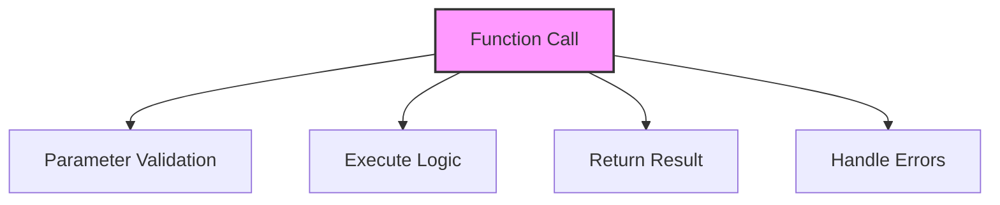

# SQL Functions

## 🎯 Learning Outcomes
By the end of this overview, you will understand:
- Types of SQL Functions
- Function usage
- Built-in functions
- User-defined functions
- Best practices for functions

## 📚 Introduction
SQL Functions:
- Data manipulation
- Calculations
- String operations
- Date handling
- Custom logic

## 🔄 Function Process


## 📊 Types of Functions

### 1. Aggregate Functions
- Multiple rows
- Summary data
- Group operations
- Statistical analysis

#### Basic Aggregates
```sql
-- Count
COUNT(column)

-- Sum
SUM(column)

-- Average
AVG(column)

-- Maximum
MAX(column)

-- Minimum
MIN(column)
```

### 2. Scalar Functions
- Single value
- Data transformation
- Type conversion
- Formatting

#### String Functions
```sql
-- Concatenation
CONCAT(string1, string2)

-- Substring
SUBSTRING(string, start, length)

-- Length
LEN(string)

-- Replace
REPLACE(string, old, new)

-- Upper/Lower
UPPER(string)
LOWER(string)
```

#### Numeric Functions
```sql
-- Round
ROUND(number, decimals)

-- Ceiling
CEILING(number)

-- Floor
FLOOR(number)

-- Absolute
ABS(number)

-- Power
POWER(number, exponent)
```

#### Date Functions
```sql
-- Current date
GETDATE()

-- Date difference
DATEDIFF(interval, date1, date2)

-- Date add
DATEADD(interval, number, date)

-- Date part
DATEPART(interval, date)

-- Format date
FORMAT(date, format)
```

### 3. Window Functions
- Partition data
- Ranking
- Running totals
- Moving averages

#### Basic Windows
```sql
-- Row number
ROW_NUMBER() OVER (ORDER BY column)

-- Rank
RANK() OVER (ORDER BY column)

-- Dense rank
DENSE_RANK() OVER (ORDER BY column)

-- Lead/Lag
LEAD(column) OVER (ORDER BY column)
LAG(column) OVER (ORDER BY column)
```

## 🔧 User-Defined Functions

### 1. Scalar Function
```sql
CREATE FUNCTION function_name
    (@param1 datatype, @param2 datatype)
RETURNS return_datatype
AS
BEGIN
    -- Function logic
    RETURN value;
END;
```

### 2. Table-Valued Function
```sql
CREATE FUNCTION function_name
    (@param1 datatype)
RETURNS TABLE
AS
RETURN
    (SELECT * FROM table_name WHERE condition);
```

## 🎯 Common Use Cases

### 1. Data Analysis
```sql
SELECT 
    Category,
    COUNT(*) as ProductCount,
    AVG(Price) as AveragePrice,
    MAX(Price) as MaxPrice,
    MIN(Price) as MinPrice
FROM Products
GROUP BY Category;
```

### 2. Data Transformation
```sql
SELECT 
    CustomerName,
    UPPER(Email) as EmailUpper,
    FORMAT(OrderDate, 'yyyy-MM-dd') as FormattedDate,
    DATEDIFF(day, OrderDate, GETDATE()) as DaysSinceOrder
FROM Orders;
```

### 3. Ranking Data
```sql
SELECT 
    ProductName,
    Price,
    RANK() OVER (ORDER BY Price DESC) as PriceRank,
    ROW_NUMBER() OVER (PARTITION BY Category 
                      ORDER BY Price DESC) as CategoryRank
FROM Products;
```

## 🎓 Best Practices
1. Use appropriate functions
2. Handle NULL values
3. Consider performance
4. Document functions
5. Test thoroughly
6. Monitor execution
7. Maintain code
8. Optimize usage

## ⚠️ Common Errors
- Syntax errors
- NULL handling
- Type conversion
- Performance issues
- Logical errors
- Maintenance
- Testing

## 📝 Quick Summary
- Function types
- Usage patterns
- Common use cases
- Performance tips
- Best practices
- Error prevention
- Optimization

## 🔍 Important Considerations
1. Function selection
2. NULL handling
3. Type conversion
4. Performance
5. Documentation
6. Testing
7. Maintenance

## 💡 Tips
- Choose appropriate functions
- Handle NULL properly
- Consider performance
- Document functions
- Test thoroughly
- Monitor execution
- Maintain code

---
*This overview provides a comprehensive understanding of SQL Functions. For practical implementation and examples, refer to the hands-on sections of the course.* 