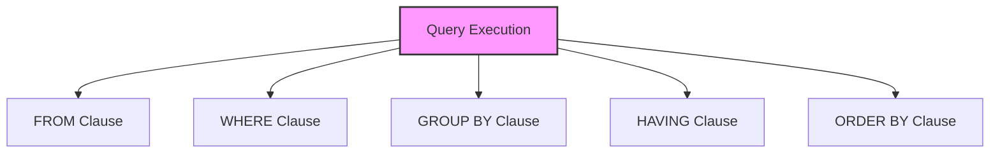

# SQL Clauses

## 🎯 Learning Outcomes
By the end of this overview, you will understand:
- Types of SQL Clauses
- Clause usage
- Clause order
- Performance considerations
- Best practices for clauses

## 📚 Introduction
SQL Clauses:
- Query structure
- Data filtering
- Result ordering
- Group operations
- Result limiting

## 🔄 Clause Process


## 📊 Types of Clauses

### 1. FROM Clause
- Table selection
- Join operations
- Subqueries
- Table aliases

#### Basic FROM
```sql
-- Single table
FROM table_name

-- Multiple tables
FROM table1 JOIN table2

-- Subquery
FROM (SELECT * FROM table) alias

-- Table alias
FROM table_name AS alias
```

### 2. WHERE Clause
- Row filtering
- Conditions
- Operators
- Subqueries

#### Basic WHERE
```sql
-- Simple condition
WHERE column = value

-- Multiple conditions
WHERE condition1 AND condition2

-- Pattern matching
WHERE column LIKE pattern

-- Range checking
WHERE column BETWEEN value1 AND value2
```

### 3. GROUP BY Clause
- Data grouping
- Aggregation
- Multiple columns
- Rollup operations

#### Basic GROUP BY
```sql
-- Single column
GROUP BY column

-- Multiple columns
GROUP BY column1, column2

-- With rollup
GROUP BY ROLLUP(column1, column2)

-- With cube
GROUP BY CUBE(column1, column2)
```

### 4. HAVING Clause
- Group filtering
- Aggregate conditions
- Post-grouping
- Complex logic

#### Basic HAVING
```sql
-- Simple condition
HAVING COUNT(*) > 1

-- Multiple conditions
HAVING COUNT(*) > 1 AND AVG(column) > 100

-- Complex logic
HAVING (COUNT(*) > 1 OR SUM(column) > 1000)
AND AVG(column) > 50
```

### 5. ORDER BY Clause
- Result sorting
- Multiple columns
- Ascending/Descending
- NULL handling

#### Basic ORDER BY
```sql
-- Single column
ORDER BY column

-- Multiple columns
ORDER BY column1, column2

-- Direction
ORDER BY column DESC

-- NULL handling
ORDER BY column NULLS FIRST
```

### 6. LIMIT/OFFSET Clause
- Result limiting
- Pagination
- Top N rows
- Skip rows

#### Basic LIMIT
```sql
-- Limit rows
LIMIT 10

-- Skip rows
OFFSET 20

-- Combined
LIMIT 10 OFFSET 20
```

## 🔧 Clause Order

### 1. Standard Order
```sql
SELECT
FROM
WHERE
GROUP BY
HAVING
ORDER BY
LIMIT
```

### 2. Execution Order
1. FROM
2. WHERE
3. GROUP BY
4. HAVING
5. SELECT
6. ORDER BY
7. LIMIT

## 🎯 Common Use Cases

### 1. Basic Query
```sql
SELECT column1, column2
FROM table
WHERE condition
GROUP BY column1
HAVING aggregate_condition
ORDER BY column1
LIMIT 10;
```

### 2. Complex Query
```sql
SELECT 
    t1.column1,
    COUNT(*) as count,
    AVG(t2.column2) as average
FROM table1 t1
JOIN table2 t2 ON t1.id = t2.id
WHERE t1.column1 > 100
GROUP BY t1.column1
HAVING COUNT(*) > 1
ORDER BY count DESC
LIMIT 5;
```

## 🎓 Best Practices
1. Use appropriate clauses
2. Consider order
3. Optimize conditions
4. Document queries
5. Test thoroughly
6. Monitor performance
7. Maintain readability
8. Use aliases

## ⚠️ Common Errors
- Syntax errors
- Order issues
- Performance problems
- Logical errors
- Maintenance
- Testing
- Documentation

## 📝 Quick Summary
- Clause types
- Usage patterns
- Order rules
- Performance tips
- Best practices
- Error prevention
- Optimization

## 🔍 Important Considerations
1. Clause selection
2. Execution order
3. Performance
4. Readability
5. Documentation
6. Testing
7. Maintenance

## 💡 Tips
- Use appropriate clauses
- Consider order
- Optimize conditions
- Document queries
- Test thoroughly
- Monitor performance
- Maintain readability

---
*This overview provides a comprehensive understanding of SQL Clauses. For practical implementation and examples, refer to the hands-on sections of the course.* 