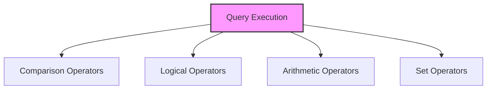

# SQL Operators

## 🎯 Learning Outcomes
By the end of this overview, you will understand:
- Types of SQL Operators
- Operator usage
- Operator precedence
- Performance considerations
- Best practices for operators

## 📚 Introduction
SQL Operators:
- Data manipulation
- Comparison
- Logical operations
- Pattern matching
- Set operations

## 🔄 Operator Process


## 📊 Types of Operators

### 1. Comparison Operators
- Equal to (=)
- Not equal to (<> or !=)
- Greater than (>)
- Less than (<)
- Greater than or equal to (>=)
- Less than or equal to (<=)
- IS NULL
- IS NOT NULL

#### Basic Comparison
```sql
-- Equal to
WHERE column = value

-- Not equal to
WHERE column <> value

-- Greater than
WHERE column > value

-- Less than
WHERE column < value

-- NULL check
WHERE column IS NULL
```

### 2. Logical Operators
- AND
- OR
- NOT
- BETWEEN
- IN
- LIKE
- EXISTS

#### Basic Logical
```sql
-- AND
WHERE condition1 AND condition2

-- OR
WHERE condition1 OR condition2

-- NOT
WHERE NOT condition

-- BETWEEN
WHERE column BETWEEN value1 AND value2

-- IN
WHERE column IN (value1, value2, value3)

-- LIKE
WHERE column LIKE pattern

-- EXISTS
WHERE EXISTS (subquery)
```

### 3. Arithmetic Operators
- Addition (+)
- Subtraction (-)
- Multiplication (*)
- Division (/)
- Modulo (%)

#### Basic Arithmetic
```sql
-- Addition
SELECT column1 + column2

-- Subtraction
SELECT column1 - column2

-- Multiplication
SELECT column1 * column2

-- Division
SELECT column1 / column2

-- Modulo
SELECT column1 % column2
```

### 4. Set Operators
- UNION
- UNION ALL
- INTERSECT
- EXCEPT/MINUS

#### Basic Set
```sql
-- UNION
SELECT * FROM table1
UNION
SELECT * FROM table2

-- UNION ALL
SELECT * FROM table1
UNION ALL
SELECT * FROM table2

-- INTERSECT
SELECT * FROM table1
INTERSECT
SELECT * FROM table2

-- EXCEPT
SELECT * FROM table1
EXCEPT
SELECT * FROM table2
```

## 🔧 Operator Precedence

### 1. Standard Precedence
1. Parentheses ()
2. Arithmetic operators
3. Comparison operators
4. Logical operators

### 2. Example
```sql
SELECT *
FROM table
WHERE (column1 > 100 OR column2 < 50)
AND column3 = 'value'
OR column4 IS NULL;
```

## 🎯 Common Use Cases

### 1. Basic Query
```sql
SELECT column1, column2
FROM table
WHERE column1 > 100
AND column2 = 'value'
OR column3 IS NULL;
```

### 2. Complex Query
```sql
SELECT 
    t1.column1,
    t2.column2
FROM table1 t1
JOIN table2 t2 ON t1.id = t2.id
WHERE (t1.column1 > 100 OR t1.column2 < 50)
AND t2.column3 = 'value'
OR t2.column4 IS NULL;
```

## 🎓 Best Practices
1. Use appropriate operators
2. Consider precedence
3. Optimize conditions
4. Document queries
5. Test thoroughly
6. Monitor performance
7. Maintain readability
8. Use parentheses

## ⚠️ Common Errors
- Syntax errors
- Precedence issues
- Performance problems
- Logical errors
- Maintenance
- Testing
- Documentation

## 📝 Quick Summary
- Operator types
- Usage patterns
- Precedence rules
- Performance tips
- Best practices
- Error prevention
- Optimization

## 🔍 Important Considerations
1. Operator selection
2. Precedence order
3. Performance
4. Readability
5. Documentation
6. Testing
7. Maintenance

## 💡 Tips
- Use appropriate operators
- Consider precedence
- Optimize conditions
- Document queries
- Test thoroughly
- Monitor performance
- Maintain readability

---
*This overview provides a comprehensive understanding of SQL Operators. For practical implementation and examples, refer to the hands-on sections of the course.* 