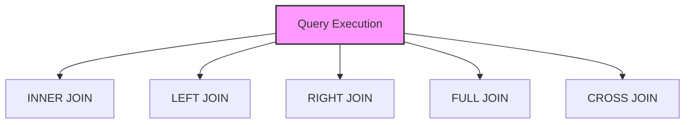

# SQL Joins

## 🎯 Learning Outcomes
By the end of this overview, you will understand:
- Types of SQL Joins
- Join conditions
- Join performance
- Join optimization
- Best practices for joins

## 📚 Introduction
SQL Joins:
- Table relationships
- Data combination
- Join types
- Join conditions
- Performance impact

## 🔄 Join Process


## 📊 Types of Joins

### 1. INNER JOIN
- Matches only
- Common records
- No NULLs
- Most common

#### Basic INNER JOIN
```sql
-- Simple join
SELECT *
FROM table1
INNER JOIN table2 ON table1.id = table2.id

-- Multiple conditions
SELECT *
FROM table1
INNER JOIN table2 ON table1.id = table2.id
AND table1.column = table2.column

-- Multiple tables
SELECT *
FROM table1
INNER JOIN table2 ON table1.id = table2.id
INNER JOIN table3 ON table2.id = table3.id
```

### 2. LEFT JOIN
- All left records
- Matching right
- NULL for no match
- Preserves left

#### Basic LEFT JOIN
```sql
-- Simple join
SELECT *
FROM table1
LEFT JOIN table2 ON table1.id = table2.id

-- Multiple conditions
SELECT *
FROM table1
LEFT JOIN table2 ON table1.id = table2.id
AND table1.column = table2.column

-- Multiple tables
SELECT *
FROM table1
LEFT JOIN table2 ON table1.id = table2.id
LEFT JOIN table3 ON table2.id = table3.id
```

### 3. RIGHT JOIN
- All right records
- Matching left
- NULL for no match
- Preserves right

#### Basic RIGHT JOIN
```sql
-- Simple join
SELECT *
FROM table1
RIGHT JOIN table2 ON table1.id = table2.id

-- Multiple conditions
SELECT *
FROM table1
RIGHT JOIN table2 ON table1.id = table2.id
AND table1.column = table2.column

-- Multiple tables
SELECT *
FROM table1
RIGHT JOIN table2 ON table1.id = table2.id
RIGHT JOIN table3 ON table2.id = table3.id
```

### 4. FULL JOIN
- All records
- Matching pairs
- NULL for no match
- Preserves both

#### Basic FULL JOIN
```sql
-- Simple join
SELECT *
FROM table1
FULL JOIN table2 ON table1.id = table2.id

-- Multiple conditions
SELECT *
FROM table1
FULL JOIN table2 ON table1.id = table2.id
AND table1.column = table2.column

-- Multiple tables
SELECT *
FROM table1
FULL JOIN table2 ON table1.id = table2.id
FULL JOIN table3 ON table2.id = table3.id
```

### 5. CROSS JOIN
- Cartesian product
- All combinations
- No conditions
- Large results

#### Basic CROSS JOIN
```sql
-- Simple join
SELECT *
FROM table1
CROSS JOIN table2

-- With WHERE
SELECT *
FROM table1
CROSS JOIN table2
WHERE table1.column = table2.column
```

## 🔧 Join Conditions

### 1. Basic Conditions
```sql
-- Equality
ON table1.column = table2.column

-- Multiple
ON table1.column1 = table2.column1
AND table1.column2 = table2.column2

-- Inequality
ON table1.column > table2.column
```

### 2. Complex Conditions
```sql
-- Subquery
ON table1.column IN (SELECT column FROM table2)

-- Function
ON UPPER(table1.column) = UPPER(table2.column)

-- Multiple tables
ON table1.column = table2.column
AND table2.column = table3.column
```

## 🎯 Common Use Cases

### 1. Basic Query
```sql
SELECT 
    t1.column1,
    t2.column2
FROM table1 t1
INNER JOIN table2 t2 ON t1.id = t2.id
WHERE t1.column1 > 100;
```

### 2. Complex Query
```sql
SELECT 
    t1.column1,
    t2.column2,
    t3.column3
FROM table1 t1
LEFT JOIN table2 t2 ON t1.id = t2.id
RIGHT JOIN table3 t3 ON t2.id = t3.id
WHERE t1.column1 > 100
AND t2.column2 = 'value';
```

## 🎓 Best Practices
1. Use appropriate joins
2. Consider performance
3. Optimize conditions
4. Document queries
5. Test thoroughly
6. Monitor performance
7. Maintain readability
8. Use aliases

## ⚠️ Common Errors
- Syntax errors
- Performance issues
- Logical errors
- Maintenance
- Testing
- Documentation

## 📝 Quick Summary
- Join types
- Usage patterns
- Performance tips
- Best practices
- Error prevention
- Optimization

## 🔍 Important Considerations
1. Join selection
2. Performance
3. Readability
4. Documentation
5. Testing
6. Maintenance

## 💡 Tips
- Use appropriate joins
- Consider performance
- Optimize conditions
- Document queries
- Test thoroughly
- Monitor performance
- Maintain readability

---
*This overview provides a comprehensive understanding of SQL Joins. For practical implementation and examples, refer to the hands-on sections of the course.* 