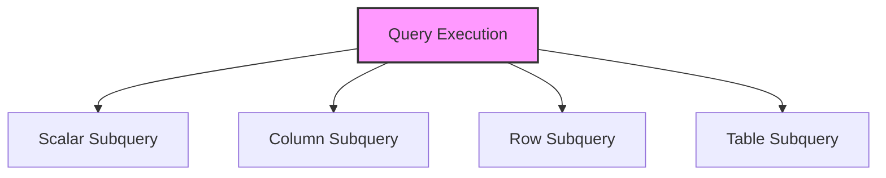

# SQL Subqueries

## 🎯 Learning Outcomes
By the end of this overview, you will understand:
- Types of SQL Subqueries
- Subquery usage
- Subquery performance
- Subquery optimization
- Best practices for subqueries

## 📚 Introduction
SQL Subqueries:
- Nested queries
- Query within query
- Data filtering
- Data comparison
- Performance impact

## 🔄 Subquery Process


## 📊 Types of Subqueries

### 1. Scalar Subquery
- Single value
- Single row
- Single column
- Comparison

#### Basic Scalar
```sql
-- Simple scalar
SELECT column1,
       (SELECT MAX(column2) FROM table2)
FROM table1

-- With condition
SELECT column1
FROM table1
WHERE column2 > (SELECT AVG(column2) FROM table1)

-- With comparison
SELECT column1
FROM table1
WHERE column2 = (SELECT column2 FROM table2 WHERE id = 1)
```

### 2. Column Subquery
- Multiple values
- Single column
- Multiple rows
- IN operator

#### Basic Column
```sql
-- Simple column
SELECT column1
FROM table1
WHERE column2 IN (SELECT column2 FROM table2)

-- With condition
SELECT column1
FROM table1
WHERE column2 IN (SELECT column2 FROM table2 WHERE column3 = 'value')

-- With comparison
SELECT column1
FROM table1
WHERE column2 IN (SELECT column2 FROM table2 WHERE column3 > 100)
```

### 3. Row Subquery
- Multiple columns
- Single row
- Row comparison
- Multiple conditions

#### Basic Row
```sql
-- Simple row
SELECT column1
FROM table1
WHERE (column2, column3) = (SELECT column2, column3 FROM table2 WHERE id = 1)

-- With condition
SELECT column1
FROM table1
WHERE (column2, column3) IN (SELECT column2, column3 FROM table2 WHERE column4 = 'value')

-- With comparison
SELECT column1
FROM table1
WHERE (column2, column3) > (SELECT column2, column3 FROM table2 WHERE id = 1)
```

### 4. Table Subquery
- Multiple columns
- Multiple rows
- Table operations
- Complex queries

#### Basic Table
```sql
-- Simple table
SELECT *
FROM (SELECT * FROM table1 WHERE column1 > 100) t

-- With join
SELECT *
FROM table1 t1
JOIN (SELECT * FROM table2 WHERE column2 = 'value') t2
ON t1.id = t2.id

-- With aggregation
SELECT *
FROM (SELECT column1, COUNT(*) as count
      FROM table1
      GROUP BY column1) t
WHERE count > 1
```

## 🔧 Subquery Usage

### 1. In SELECT
```sql
-- Simple select
SELECT column1,
       (SELECT MAX(column2) FROM table2) as max_value
FROM table1

-- With condition
SELECT column1,
       (SELECT AVG(column2) FROM table2 WHERE column3 = 'value') as avg_value
FROM table1
```

### 2. In WHERE
```sql
-- Simple where
SELECT column1
FROM table1
WHERE column2 IN (SELECT column2 FROM table2)

-- With condition
SELECT column1
FROM table1
WHERE column2 > (SELECT AVG(column2) FROM table1)

-- With comparison
SELECT column1
FROM table1
WHERE EXISTS (SELECT 1 FROM table2 WHERE table2.id = table1.id)
```

### 3. In FROM
```sql
-- Simple from
SELECT *
FROM (SELECT * FROM table1 WHERE column1 > 100) t

-- With join
SELECT *
FROM table1 t1
JOIN (SELECT * FROM table2 WHERE column2 = 'value') t2
ON t1.id = t2.id

-- With aggregation
SELECT *
FROM (SELECT column1, COUNT(*) as count
      FROM table1
      GROUP BY column1) t
WHERE count > 1
```

## 🎯 Common Use Cases

### 1. Basic Query
```sql
SELECT column1
FROM table1
WHERE column2 IN (SELECT column2 FROM table2 WHERE column3 = 'value');
```

### 2. Complex Query
```sql
SELECT 
    t1.column1,
    (SELECT MAX(column2) FROM table2 WHERE table2.id = t1.id) as max_value
FROM table1 t1
WHERE EXISTS (SELECT 1 FROM table2 WHERE table2.id = t1.id AND column3 > 100);
```

## 🎓 Best Practices
1. Use appropriate subqueries
2. Consider performance
3. Optimize conditions
4. Document queries
5. Test thoroughly
6. Monitor performance
7. Maintain readability
8. Use aliases

## ⚠️ Common Errors
- Syntax errors
- Performance issues
- Logical errors
- Maintenance
- Testing
- Documentation

## 📝 Quick Summary
- Subquery types
- Usage patterns
- Performance tips
- Best practices
- Error prevention
- Optimization

## 🔍 Important Considerations
1. Subquery selection
2. Performance
3. Readability
4. Documentation
5. Testing
6. Maintenance

## 💡 Tips
- Use appropriate subqueries
- Consider performance
- Optimize conditions
- Document queries
- Test thoroughly
- Monitor performance
- Maintain readability

---
*This overview provides a comprehensive understanding of SQL Subqueries. For practical implementation and examples, refer to the hands-on sections of the course.* 