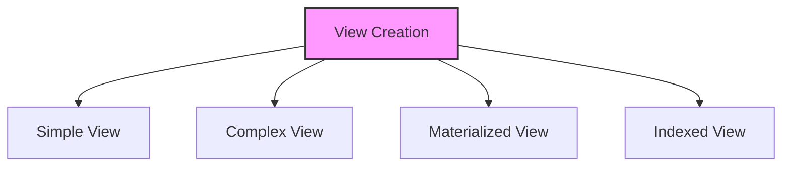

# SQL Views

## 🎯 Learning Outcomes
By the end of this overview, you will understand:
- Types of SQL Views
- View creation
- View modification
- View performance
- Best practices for views

## 📚 Introduction
SQL Views:
- Virtual tables
- Query results
- Data abstraction
- Security layer
- Performance impact

## 🔄 View Process


## 📊 Types of Views

### 1. Simple View
- Single table
- No aggregation
- No grouping
- Direct mapping

#### Basic Simple View
```sql
-- Create view
CREATE VIEW view_name AS
SELECT column1, column2
FROM table1
WHERE condition;

-- Use view
SELECT * FROM view_name;

-- Drop view
DROP VIEW view_name;
```

### 2. Complex View
- Multiple tables
- Aggregation
- Grouping
- Complex logic

#### Basic Complex View
```sql
-- Create view
CREATE VIEW view_name AS
SELECT t1.column1,
       COUNT(*) as count,
       AVG(t2.column2) as average
FROM table1 t1
JOIN table2 t2 ON t1.id = t2.id
GROUP BY t1.column1;

-- Use view
SELECT * FROM view_name;

-- Drop view
DROP VIEW view_name;
```

### 3. Materialized View
- Physical storage
- Periodic refresh
- Performance boost
- Space trade-off

#### Basic Materialized
```sql
-- Create view
CREATE MATERIALIZED VIEW view_name AS
SELECT column1, column2
FROM table1
WHERE condition;

-- Refresh view
REFRESH MATERIALIZED VIEW view_name;

-- Drop view
DROP MATERIALIZED VIEW view_name;
```

### 4. Indexed View
- Indexed storage
- Real-time update
- Performance boost
- Space trade-off

#### Basic Indexed
```sql
-- Create view
CREATE VIEW view_name WITH SCHEMABINDING AS
SELECT column1, column2
FROM table1
WHERE condition;

-- Create index
CREATE UNIQUE CLUSTERED INDEX index_name
ON view_name (column1);

-- Drop view
DROP VIEW view_name;
```

## 🔧 View Operations

### 1. Create View
```sql
-- Simple view
CREATE VIEW view_name AS
SELECT column1, column2
FROM table1
WHERE condition;

-- Complex view
CREATE VIEW view_name AS
SELECT t1.column1,
       t2.column2
FROM table1 t1
JOIN table2 t2 ON t1.id = t2.id
WHERE t1.column1 > 100;
```

### 2. Modify View
```sql
-- Alter view
ALTER VIEW view_name AS
SELECT column1, column2
FROM table1
WHERE condition;

-- Replace view
CREATE OR REPLACE VIEW view_name AS
SELECT column1, column2
FROM table1
WHERE condition;
```

### 3. Drop View
```sql
-- Drop view
DROP VIEW view_name;

-- Drop if exists
DROP VIEW IF EXISTS view_name;
```

## 🎯 Common Use Cases

### 1. Basic View
```sql
-- Create view
CREATE VIEW employee_details AS
SELECT id, name, department
FROM employees
WHERE active = true;

-- Use view
SELECT * FROM employee_details;
```

### 2. Complex View
```sql
-- Create view
CREATE VIEW department_summary AS
SELECT d.name,
       COUNT(e.id) as employee_count,
       AVG(e.salary) as avg_salary
FROM departments d
LEFT JOIN employees e ON d.id = e.department_id
GROUP BY d.name;

-- Use view
SELECT * FROM department_summary;
```

## 🎓 Best Practices
1. Use appropriate views
2. Consider performance
3. Optimize queries
4. Document views
5. Test thoroughly
6. Monitor performance
7. Maintain readability
8. Use aliases

## ⚠️ Common Errors
- Syntax errors
- Performance issues
- Logical errors
- Maintenance
- Testing
- Documentation

## 📝 Quick Summary
- View types
- Usage patterns
- Performance tips
- Best practices
- Error prevention
- Optimization

## 🔍 Important Considerations
1. View selection
2. Performance
3. Readability
4. Documentation
5. Testing
6. Maintenance

## 💡 Tips
- Use appropriate views
- Consider performance
- Optimize queries
- Document views
- Test thoroughly
- Monitor performance
- Maintain readability

---
*This overview provides a comprehensive understanding of SQL Views. For practical implementation and examples, refer to the hands-on sections of the course.* 