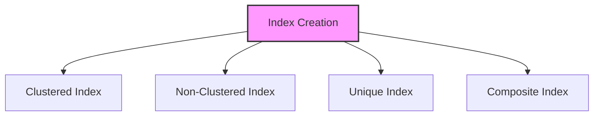

# SQL Indexes

## 🎯 Learning Outcomes
By the end of this overview, you will understand:
- Types of SQL Indexes
- Index creation
- Index maintenance
- Index performance
- Best practices for indexes

## 📚 Introduction
SQL Indexes:
- Performance optimization
- Data access speed
- Storage overhead
- Maintenance cost
- Query optimization

## 🔄 Index Process


## 📊 Types of Indexes

### 1. Clustered Index
- Physical ordering
- One per table
- Primary key
- Data storage

#### Basic Clustered
```sql
-- Create clustered
CREATE CLUSTERED INDEX index_name
ON table_name (column1);

-- Drop index
DROP INDEX index_name ON table_name;
```

### 2. Non-Clustered Index
- Logical ordering
- Multiple per table
- Secondary access
- Pointer storage

#### Basic Non-Clustered
```sql
-- Create non-clustered
CREATE NONCLUSTERED INDEX index_name
ON table_name (column1);

-- Drop index
DROP INDEX index_name ON table_name;
```

### 3. Unique Index
- No duplicates
- Data integrity
- Performance
- Constraint

#### Basic Unique
```sql
-- Create unique
CREATE UNIQUE INDEX index_name
ON table_name (column1);

-- Drop index
DROP INDEX index_name ON table_name;
```

### 4. Composite Index
- Multiple columns
- Order matters
- Prefix rule
- Performance

#### Basic Composite
```sql
-- Create composite
CREATE INDEX index_name
ON table_name (column1, column2);

-- Drop index
DROP INDEX index_name ON table_name;
```

## 🔧 Index Operations

### 1. Create Index
```sql
-- Simple index
CREATE INDEX index_name
ON table_name (column1);

-- Unique index
CREATE UNIQUE INDEX index_name
ON table_name (column1);

-- Composite index
CREATE INDEX index_name
ON table_name (column1, column2);
```

### 2. Modify Index
```sql
-- Rebuild index
ALTER INDEX index_name
ON table_name REBUILD;

-- Reorganize index
ALTER INDEX index_name
ON table_name REORGANIZE;
```

### 3. Drop Index
```sql
-- Drop index
DROP INDEX index_name ON table_name;

-- Drop if exists
IF EXISTS (SELECT * FROM sys.indexes WHERE name = 'index_name')
    DROP INDEX index_name ON table_name;
```

## 🎯 Common Use Cases

### 1. Basic Index
```sql
-- Create index
CREATE INDEX idx_employee_name
ON employees (last_name, first_name);

-- Use index
SELECT * FROM employees
WHERE last_name = 'Smith';
```

### 2. Complex Index
```sql
-- Create index
CREATE INDEX idx_order_date_customer
ON orders (order_date, customer_id)
INCLUDE (total_amount);

-- Use index
SELECT order_date, customer_id, total_amount
FROM orders
WHERE order_date BETWEEN '2023-01-01' AND '2023-12-31';
```

## 🎓 Best Practices
1. Use appropriate indexes
2. Consider performance
3. Monitor usage
4. Document indexes
5. Test thoroughly
6. Maintain regularly
7. Balance overhead
8. Review periodically

## ⚠️ Common Errors
- Too many indexes
- Wrong columns
- Maintenance issues
- Performance problems
- Storage overhead
- Testing
- Documentation

## 📝 Quick Summary
- Index types
- Usage patterns
- Performance tips
- Best practices
- Error prevention
- Optimization

## 🔍 Important Considerations
1. Index selection
2. Performance
3. Maintenance
4. Documentation
5. Testing
6. Storage

## 💡 Tips
- Use appropriate indexes
- Consider performance
- Monitor usage
- Document indexes
- Test thoroughly
- Maintain regularly
- Review periodically

---
*This overview provides a comprehensive understanding of SQL Indexes. For practical implementation and examples, refer to the hands-on sections of the course.* 