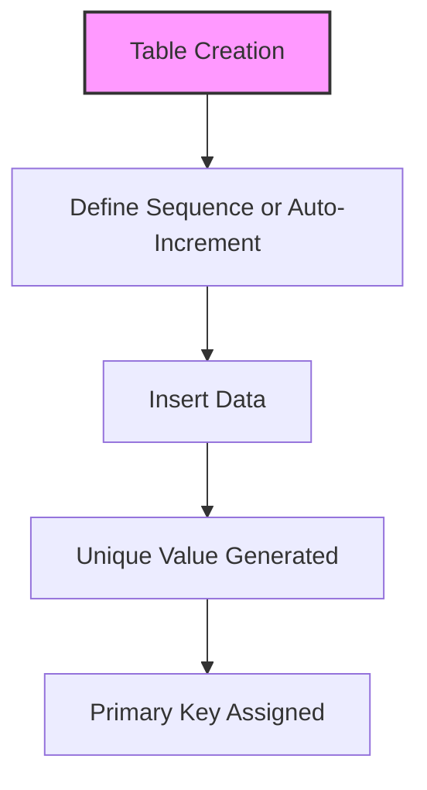

# SQL Sequences & Auto-Increment

## 🎯 Learning Outcomes
By the end of this overview, you will understand:
- The concept of sequences and auto-increment
- How to create and use sequences
- How to define auto-increment columns
- Differences across RDBMS
- Best practices for generating unique values

## 📚 Introduction
Sequences and auto-increment:
- Automatically generate unique numbers
- Commonly used for primary keys
- Reduce manual value assignment
- Improve data integrity
- Syntax varies by RDBMS

## 🔄 Sequence & Auto-Increment Process


## 📊 Sequences

### 1. Creating a Sequence (Standard SQL / Oracle / PostgreSQL)
```sql
CREATE SEQUENCE seq_name
    START WITH 1
    INCREMENT BY 1
    MINVALUE 1
    MAXVALUE 999999
    CYCLE
    CACHE 10;
```

### 2. Using a Sequence
```sql
-- Oracle
INSERT INTO table_name (id, column1) VALUES (seq_name.NEXTVAL, 'value');

-- PostgreSQL
INSERT INTO table_name (id, column1) VALUES (nextval('seq_name'), 'value');
```

### 3. Altering/Resetting a Sequence
```sql
ALTER SEQUENCE seq_name RESTART WITH 1;
```

## 📈 Auto-Increment Columns

### 1. MySQL
```sql
CREATE TABLE table_name (
    id INT AUTO_INCREMENT PRIMARY KEY,
    column1 VARCHAR(100)
);
```

### 2. SQL Server
```sql
CREATE TABLE table_name (
    id INT IDENTITY(1,1) PRIMARY KEY,
    column1 VARCHAR(100)
);
```

### 3. PostgreSQL
```sql
CREATE TABLE table_name (
    id SERIAL PRIMARY KEY,
    column1 VARCHAR(100)
);
```

### 4. SQLite
```sql
CREATE TABLE table_name (
    id INTEGER PRIMARY KEY AUTOINCREMENT,
    column1 TEXT
);
```

## 🔧 Best Practices
1. Use auto-increment for surrogate keys
2. Avoid manual value assignment
3. Document sequence usage
4. Monitor for value exhaustion
5. Handle concurrency
6. Use appropriate data types
7. Reset sequences carefully

## ⚠️ Common Errors
- Value overflow
- Manual insert conflicts
- Sequence gaps
- RDBMS syntax differences
- Resetting issues
- Permission errors

## 📝 Quick Summary
- Sequences and auto-increment generate unique values
- Syntax varies by RDBMS
- Used for primary keys
- Reduce manual errors
- Best for surrogate keys

## 🔍 Important Considerations
1. RDBMS compatibility
2. Value limits
3. Concurrency
4. Resetting sequences
5. Documentation
6. Testing

## 💡 Tips
- Use auto-increment for primary keys
- Monitor sequence usage
- Document sequence logic
- Test for concurrency
- Reset with caution

---
*This overview provides a comprehensive understanding of SQL Sequences and Auto-Increment. For practical implementation and examples, refer to the hands-on sections of the course.* 