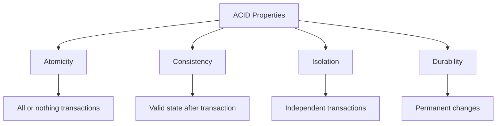
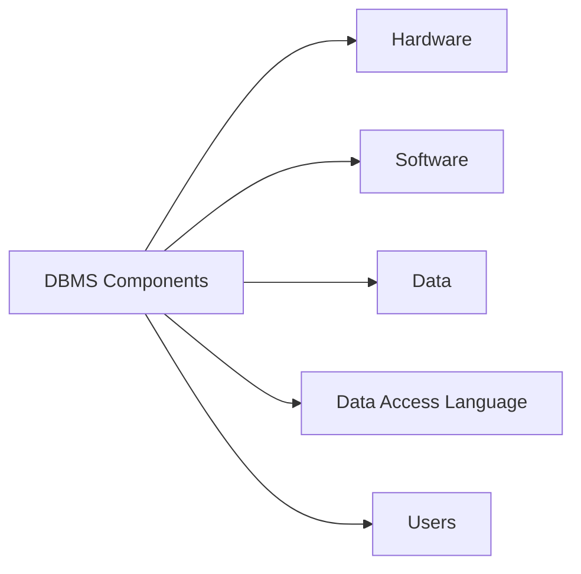

# Database Management System (DBMS) Tutorial

## 🎯 Learning Outcomes
By the end of this tutorial, you will be able to:
- Understand the fundamental concepts of Database Management Systems
- Comprehend DBMS architecture and data models
- Master database design principles including normalization
- Apply ACID properties in database transactions
- Design and implement database schemas
- Work with different types of database keys and relationships

## 📚 Introduction
A Database Management System (DBMS) is a technology that efficiently stores and retrieves user data while maintaining appropriate security measures. This comprehensive tutorial covers essential DBMS concepts including:
- Architecture
- Data models
- Data schema
- Data independence
- E-R model
- Relational model
- Database design
- Storage and file structure

## 🎓 Why Learn DBMS?
DBMS revolutionized data management by overcoming the limitations of traditional file-based systems. Modern DBMS offers several advantages:

### Key Characteristics
- **Real-world Entity Representation**
  - Uses realistic entities and their attributes
  - Example: School database with students as entities and age as attributes

- **Relation-based Tables**
  - Organizes data in structured tables
  - Clear visualization of database architecture

- **Data-Application Isolation**
  - Separates database system from its data
  - Maintains metadata for efficient operations

- **Reduced Redundancy**
  - Implements normalization rules
  - Scientifically reduces data duplication

- **Consistency**
  - Maintains database consistency
  - Implements methods to detect inconsistencies

- **Query Language Support**
  - Efficient data retrieval and manipulation
  - Advanced filtering capabilities

## 🔑 DBMS Characteristics

### ACID Properties

### Key Features
1. **Multi-user Support**
   - Concurrent access capabilities
   - Parallel data manipulation
   - Transaction management

2. **Multiple Views**
   - Department-specific views
   - Customized data presentation
   - Enhanced user experience

3. **Security**
   - Access control
   - Data constraints
   - Multiple security levels

## 💼 Career Opportunities
The growing demand for DBMS professionals spans various roles:

| Role | Description |
|------|-------------|
| Database Administrator (DBA) | Manages and maintains databases |
| Data Analyst | Analyzes and interprets data |
| Database Manager | Oversees database operations |
| Data Scientist | Applies advanced analytics |
| Database Tester | Ensures database quality |
| Cloud Database Expert | Manages cloud-based databases |
| Information Security Analyst | Ensures data security |
| Data Modeler | Designs database structures |

## 📋 Prerequisites
Before starting this tutorial, you should have:
- Basic understanding of computer concepts
- Knowledge of primary and secondary memory
- Fundamentals of data structures and algorithms

## ❓ Frequently Asked Questions

### Basic Concepts
1. **What is DBMS?**
   - Database Management System
   - Technology for storing and retrieving data efficiently

2. **What is a Database?**
   - Organized collection of structured data
   - Can be stored locally or remotely

### Components

### Key Concepts
1. **ACID Properties**
   - Atomicity
   - Consistency
   - Isolation
   - Durability

2. **Database Keys**
   - Primary Key: Unique identifier for records
   - Composite Key: Multiple columns forming a unique identifier

3. **Database Views**
   - Virtual tables created from queries
   - Customized data presentation

4. **Database Triggers**
   - Automated instructions
   - Event-driven execution

## 📝 Quick Summary
- DBMS is essential for modern data management
- Offers structured, secure, and efficient data handling
- Supports multiple users and concurrent operations
- Provides various career opportunities in tech industry
- Requires understanding of basic computer concepts

## 📚 Further Reading
- Database Design Patterns
- Advanced SQL Queries
- Database Security Best Practices
- Cloud Database Solutions
- Big Data Management

---
*This tutorial is designed to provide a comprehensive understanding of Database Management Systems. For hands-on practice, refer to the code examples and exercises provided in subsequent sections.* 