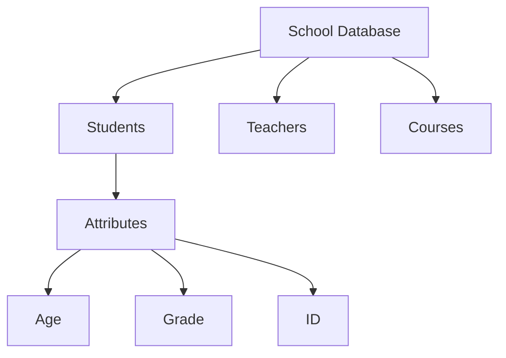
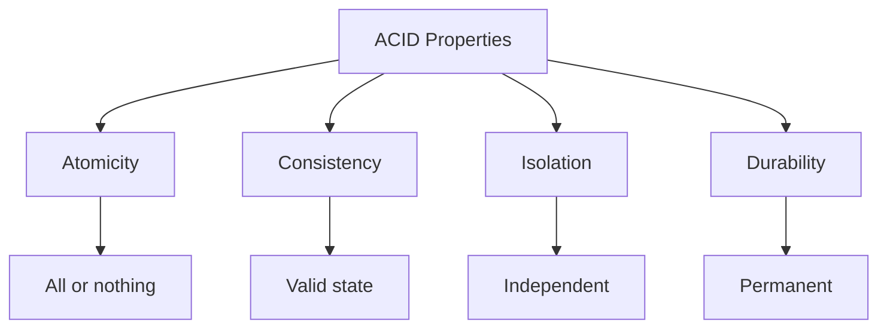
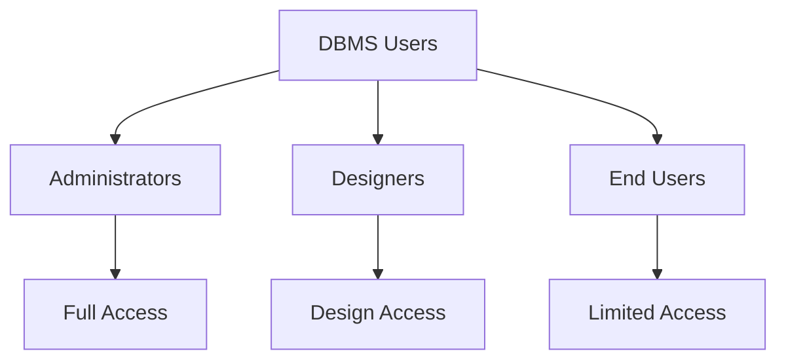

# Database Management System Overview

## 🎯 Learning Outcomes
By the end of this overview, you will understand:
- Basic concepts of databases and data management
- Key characteristics of modern DBMS
- Different types of DBMS users and their roles
- ACID properties and their importance
- Security and data isolation concepts

## 📚 Introduction to Databases
A database is a collection of related data, where data represents facts and figures that can be processed to produce information. For example, student marks data can be used to determine toppers and calculate average marks.

## 🔑 Key Characteristics of Modern DBMS

### 1. Real-world Entity Representation

- Uses real-world entities in design
- Incorporates behavior and attributes
- Example: School database with students as entities

### 2. Relation-based Tables
- Entities and relationships form tables
- Clear database architecture visualization
- Structured data organization

### 3. Data-Application Isolation
- Database system ≠ Data
- Database: Active entity
- Data: Passive entity
- Metadata storage for efficient processing

### 4. Reduced Redundancy
- Normalization rules implementation
- Scientific process for redundancy reduction
- Efficient data storage

### 5. Consistency
- Maintains database consistency
- Detection methods for inconsistencies
- Superior to file-processing systems

### 6. Query Language
- Efficient data retrieval
- Advanced filtering options
- Flexible data manipulation

## ⚡ ACID Properties

### Key Benefits
- Ensures database health
- Manages multi-transactional environments
- Handles failure scenarios
- Maintains data integrity

## 👥 Multi-user Features

### 1. Concurrent Access
- Parallel data manipulation
- Transaction restrictions
- User-transparent operations

### 2. Multiple Views
- Department-specific views
- Customized data presentation
- Example: Sales vs Production views

### 3. Security Features
- Access control
- Data constraints
- Multiple security levels
- Department isolation
- Disk-based security

## 👤 DBMS Users

### 1. Administrators
**Responsibilities:**
- DBMS maintenance
- Access control
- Resource management
- Security implementation
- System monitoring

### 2. Designers
**Responsibilities:**
- Database design
- Entity identification
- Relationship mapping
- Constraint definition
- View creation

### 3. End Users
**Types:**
- Simple viewers
- Business analysts
- Data consumers
- Report generators

## 📊 User Access Levels

## 📝 Quick Summary
- Modern DBMS overcomes traditional file system limitations
- Provides structured, secure data management
- Supports multiple users with different access levels
- Ensures data integrity through ACID properties
- Offers flexible querying and data manipulation

## 🔍 Key Takeaways
1. DBMS provides efficient data management
2. Multiple user types with different access levels
3. Strong security and isolation features
4. ACID properties ensure data integrity
5. Flexible querying capabilities

---
*This overview provides a comprehensive understanding of Database Management Systems, their characteristics, and user roles. For detailed implementation and hands-on practice, refer to the specific tutorial sections.* 